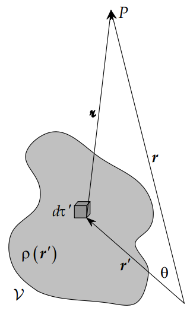
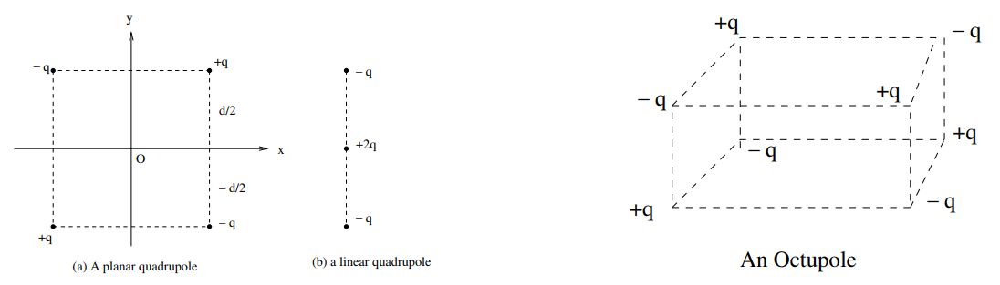

Multipole Expansion
===================
A multipole expansion is a series representation of a function that depends on angle, typically the two angles on a sphere. Representing a function in this form is useful in cases where higher order terms can be neglected whilst remaining a good approximation to the original function.

<!-- TODO write up spherical harmonics -->
The series is most commonly written as a sum of [spherical harmonics](../../maths/spherical-harmonics.md), e.g.
$$
f(\theta ,\phi )=\sum _{l=0}^\infty\,\sum _{m=-l}^l\,C_l^m\,Y_l^m(\theta ,\phi )\,,
$$
where $Y_l^m$ are the spherical harmonics, and $C_l^m$ the coefficents which depend upon $f$. To describe functions of three dimensions, often $C_l^m$ is instead written $C_l^m(r)$.

Electric Potential
------------------
Suppose that we have a known charge distribution, for which we want to know the potential *outside* the region of charge. If the distribution were symmetrical, one could find answers using
* Gauss' Law (direct calculation).
* Coulomb's Law (direct calculation).
* Solutions of the Laplace equation (using the charge distribution for boundary conditions).

Even when $\rho(\vb{r})$ is symmetrical, this can be quite tedious, and for asymmetric potentials proves highly complicated. Consider instead a direct calculation using a series expansion.

Given that the reference point for a potential may be arbitrary, let us use $r=\infty$.

Consider the potential at some point $\vb{r}$, taken as a superposition of point charges, where $r \gg r'$
$$
    V(\vb{r}) = \frac{1}{4\pi\epsilon_0}\int_{V'}\frac{\rho(\vb{r'})}{\abs{\vb{r}-\vb{r'}}}\dd V'\,.
$$

Here, 
$$
    \tag{a}
    \begin{aligned}
    \abs{\vb{r}-\vb{r'}} &= \sqrt{r^2+r'^2-2\vb{r}\cdot\vb{r'}}\\
                         &= r\sqrt{1 + \frac{r'}{r}^2 - \frac{2\vb{r}\cdot\vb{r'}}{r^2}}\,,
    \end{aligned}
$$

hence we may write $\frac{1}{\abs{\vb{r}-\vb{r'}}}$ as 
$$
    \frac{1}{\abs{\vb{r}-\vb{r'}}} = \frac{1}{r}\frac{1}{\sqrt{1 + \frac{r'}{r}^2 -\frac{2r'}{r}\cos(\theta)}}\,.
$$
This may then be expanded using the [binomial expansion](https://en.wikipedia.org/wiki/Binomial_theorem)
$$
\frac {1}{(1-x)^{s}}=\sum _{k=0}^{\infty }{s+k-1 \choose k}x^{k}\,,
$$
to give
$$
    \def\term{\left(\frac{r'}{r}\left[\frac{r'}{r} - 2\cos(\theta)\right]\right)}
    \frac{1}{r}\left[1-\frac{1}{2}\term+\frac{3}{8}\term^2-\frac{5}{16}\term^3\dots\right]\,.
$$

Grouping terms of the same order of $\frac{r'}{r}$, we find
$$
    \def\term{\left(\frac{r'}{r}\right)}
    \begin{aligned}
        \frac{1}{\abs{\vb{r}-\vb{r'}}} &= \frac{1}{r}\left[
            1 + \term\cos(\theta)+\term^2\left(-\frac{1}{2}+\frac{3}{2}\cos^2(\theta)\right) + \term^3\left(-\frac{3}{2}\cos(\theta)+\frac{5}{2}\cos^3(\theta)\right) + \dots
        \right]\\
        &= \frac{1}{r}\left[
        P_0(\cos(\theta)) + \term P_1(\cos(\theta)) + \term^2 P_2(\cos(\theta)) + \term^3P_3(\cos(\theta)) + \dots
        \right]\,.
    \end{aligned}
$$
From the recursion relation $${\displaystyle (n+1)P_{n+1}(x)=(2n+1)xP_{n}(x)-nP_{n-1}(x)}\,, $$ it can be seen that these $P_l$ are the [Legendre Polynomials](../maths/legendre-equation.md)
<!-- TODO legendre polynomials -->

Thus $V(\vb{r})$ becomes
$$
\tag{b}
    \begin{aligned}
        V(\vb{r}) &= \frac{1}{4\pi\epsilon_0}\int_{V'}\rho(\vb{r'})\frac{1}{r}\sum_{n=0}^\infty\left(\frac{r'}{r}\right)^nP_n\cos(\theta)\dd V'\\
        &= \frac{1}{4\pi\epsilon_0}\Bigg[\frac{1}{r}\int_{V'}\rho(\vb{r'})\dd V' + \\
        &\hspace{4 em}\frac{1}{r^2}\int_{V'}\rho(\vb{r'})r'P_1(\cos(\theta))\dd V' + \\
        &\hspace{4 em}\frac{1}{r^3}\int_{V'}\rho(\vb{r'})r'^2P_2(\cos(\theta))\dd V' +\\
        &\hspace{4 em}\frac{1}{r^4}\int_{V'}\rho(\vb{r'})r'^3P_3(\cos(\theta))\dd V' + \dots
\Bigg]\\
    &= V_\text{monopole} + V_\text{dipole} + V_\text{quadrupole} + V_\text{octupole} + \dots\,,
    \end{aligned}
$$

a simple sum of a series of multipole potentials. 

The _monopole moment_ of the charge distribution $\rho(\vb{r})$ is given by the integral 
$$
Q_\text{monopole} = \int_{V'}\rho(\vb{r'})\dd V'\,.
$$
Similarly, the _dipole moment_ is given by
$$
Q_\text{dipole} = \int_{V'}\vb{r'}\rho(\vb{r'})\dd V'\,,
$$
whose component in a direction $\vu{R}$ is given by 
$$
    M_1(\vu{R})=\vu{R}\cdot \vb{Q_\text{dipole}}\,.
$$
<!-- TODO define tensor -->evince
The _quadrupole moment_ is a 2 index symmetric tensor, given by
$$
Q_\text{quadrupole} = \int_{V'} \left(\frac{3}{2}r'_ir'_j-\frac{1}{2}\delta_{ij}r'^{\,2}\right)\rho(\vb{r'})\dd V'\,,
$$
whose $\vu{R}$ component is given by[^1]
$$
M_2(\vu{R})=\sum_{i,j=x,y,z}{\hat{R_i}\hat{R_j}Q_{ij}}\,.
$$
This follows from 
$$
\begin{aligned}
r^2P_2(\cos(\theta))&=r^2P_2(\vu{R}\cdot\vu{r'})\\
&= \frac{3}{2}r'^{\,2}\left(\vu{R}\cdot\vu{r'}\right) - \frac{1}{2}r'^{\,2}\\
&= \frac{3}{2}\left(\vu{R}\cdot\vb{r'}\right)^2 - \frac{1}{2}r^2\left(\vu{R}\cdot\vu{R}\right)\\
&= \frac{3}{2}\sum_i\sum_j\hat{R_i}\hat{R_j}r'^{\,2}_ir'^{\,2}_j - \frac{r'^{\,2}}{2}\sum_i\sum_j\hat{R_i}\hat{R_j}\delta_{ij}\\
&= \sum_i\sum_j\hat{R_i}\hat{R_j}\left(\frac{3}{2}r'_ir'_j-\frac{1}{2}r'^{\,2}\delta_{ij}\right)\,,
\end{aligned}
$$
which integrates to
$$
\begin{aligned}
M_3(\vb{R'}) &= \int_{V'}r'^{\,2}P_2(\vu{R}\cdot\vu{r'})\rho(\vb{r'})\dd V'\\
&= \sum_{ij}\hat{R_i}\hat{R_j}\int_{V'}\left(\frac{3}{2}r'_ir'_j-\frac{1}{2}r'^{\,2}\delta_{ij}\right)\rho(\vb{r})\dd V'\\
&= \sum_{ij}\hat{R_i}\hat{R_j}Q_{ij}\,.
\end{aligned}
$$

---
Instead of describing the angular dependence of the multipoles’ components in the direction $\hat{R}$ in terms of symmetric multipole tensors, we may expand it in terms of spherical harmonics. It can be shown that[^1], for any integer $l=0,1,2,\dots$ and any two unit vectors $\vu{a}$ and $\vu{b}$, the Legendre polynomial of their dot product (i.e. the cosine of the angle between them) expands into products of spherical harmonics, given by
$$
P_l(\vb{a}\cdot\vb{b}) = \frac{4\pi}{2l+1}\sum_{m=-l}^{+l}Y_{lm}(\vb{a})Y^*_{lm}(\vb{b})\,.
$$

<!-- The Legendre expansion assumes a coordinate system in which the -->
[^1]: http://bolvan.ph.utexas.edu/~vadim/Classes/2018f/mme.pdf