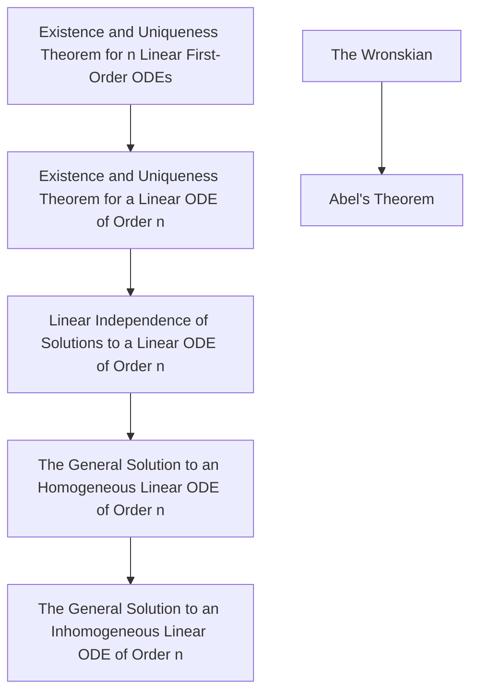

# Index

The fundamental theory behind linear ODEs is established by the following theorems:

```mermaid
graph TD
    th1[Existence and Uniqueness Theorem for n Linear First-Order ODEs] --> th2
    th2[Existence and Uniqueness Theorem for a Linear ODE of Order n] --> th3
    th3[Linear Independence of Solutions to a Linear ODE of Order n] --> th4
    th4[The General Solution to an Homogeneous Linear ODE of Order n] --> th5
    th5[The General Solution to an Inhomogeneous Linear ODE of Order n]

    aux1[The Wronskian] --> aux2
    aux2[Abel's Theorem]

    click th1 "first-order-existence-theorem.md"
    click th2 "n-order-existence-theorem.md"
    click th3 "n-order-independence.md"
    click th4 "n-order-homogeneous-general-solution.md"
```
