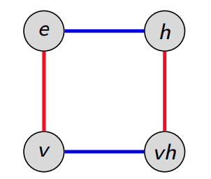

Group
=====

A group $(G,\circ)$ is a [set](set.md) $G$ combined with a binary operation $(\circ)$ which combines two elements of the set to produce a third element, whilst satisfying the four [group axioms](#Group-Axioms). 
The group may sometimes be referred to by its _underlying set_ directly, e.g. $G$. 

A group $H$ is called a *subgroup* of $G$ (denoted $H\subseteq G$) iff. $H$ is a group and its elements are a subset of the elements of $G$.

Axioms
------

|       Name       |                         Definition                          |
| :--------------: | :---------------------------------------------------------: |
|  Associativity   | $$\forall a,b,c\in G, (a\circ b)\circ c=a\circ (b\circ c)$$ |
|     Closure      |             $$\forall a,b\in G, a\circ b\in G$$             |
| Identity Element |    $$\exist e\in G:\forall a\in G, e\circ a=a\circ e=a$$    |
| Inverse Element  |   $$\forall a\in G, \exists b\in G:a\circ b=b\circ a=e$$    |

Morphisms
---------
Homomorphism
  ~ A map between groups that respects the group structure, i.e.
  $$
      \phi\colon G_1\rightarrow G_2
  $$ is a homomorphism iff.
  $$
      \forall\,a,b\in G_1,G_2 : \phi(a\circ b) = \phi(a)\circ\phi(b)\,,
  $$
  where $\circ$ is the binary operation of the respective group.
  
Isomorphism
  ~ A [bijective](map.md#Relations) group homomorphism, represented by $G_1\cong G_2$. 

Generators
----------
The generators of a group are a set of elements from which all other elements can be generated through the group multiplication law.[^group-theory] Let $\tilde{G}$ be the generators of group $G$, then
$$
G = \set{(u\circ v):u,v\in \tilde{G}}\,.
$$

Conjugacy
---------
Two elements $a,b\in G$ are conjugate if there exists an element $g\in G$ such that $gag^{-1} = b$.[^group-theory] In this manner, $a$ and $b$ are conjugate of one another. This forms an [equivalence class](equivalence-class.md) of $a$ given by
$$
\bqty{a} = \set{gag^{-1} : g \in G}\,.
$$
The number of distinct conjugacy classes of the group $G$ is called the *class number of $G$*. The minimal number of elements which generate $G$ (i.e. the order of the minimal $\tilde{G}$) is called the *rank* of $G$.

Centre
--------
The centre $Z$  of a group $G$ is the subset of elements which commute with *all elements of the group*, given by 
$$
    Z(G) = \set{z \in G : \forall g \in G: z\circ g = g \circ z}\,.
$$

Order
-----
Order of a Group
    ~ The order of a group $G$ denoted $\abs{G}$ counts the number of elements in the group.[^group-theory] 

Order of a Group Element
    ~ The order of a group *element* $g\in G$ denoted by $\abs{g}$ is the smallest integer for which $g^n = e$, where $e$ is the identity of the group, and $g^n$ is given by 
$$
\begin{aligned}
g^1 &= g\\
g^2 &= (g\circ g^1)\\
g^3 &= (g\circ g^2)\\
&\;\;\vdots\\
g^n &= (g\circ  g^{n-1})\\
\end{aligned}\,.
$$

Presentation
------------
A group may be specified by its *presentation* $\braket{S}{R}$ comprised of a set $S$ of generators and set $R$ of relations amongst those generators. A presentation may describe several groups, and thus $\braket{S}{R}$ is taken to be the presentation of $G$ if $G$ is the *largest group* which satisfies the presentation.[^presentation]

Consider the following trivial example[^group-calculator]:  

In this diagram, each element of $g\in G$ is assigned a vertex. Let $\tilde{G}=\set{h,v}$ be the set of (horizontal/vertical) flip generators. Each generator $\tilde{g}\in\tilde{G}$ is assigned a colour.  
It can be seen that a horizontal followed by vertical flip produces $e\rightarrow h\circ e \rightarrow v\circ (h\circ e)$. Equally, the reverse ordered transformation $e\rightarrow v\circ e \rightarrow h\circ (v\circ e)$ ends up at the same vertex. This introduces the relation 
$$
    v\circ h = h\circ v\,.
$$
Additionally, repeated application of the a generator leaves the original element unchanged, i.e.
$$
    v\circ v = h\circ h = e\,,
$$
where $e$ is the identity element. The presentation for this group is
$$
    V_4 = \braket{v,h}{v\circ v=e,h\circ h=e, v\circ h = h\circ v}
$$

Coset
-----
Given a subgroup $H\subset G$, the *left*-coset $gH$ for each element $g\in G$ is defined as
$$
g\circ H = \set{g\circ h : h \in H}\,.
$$
Analogously, one can also define the *right*-coset.
<!-- It seems that frequently people choose additive or multiplicative notation instead of the explicit `\circ` notation, but I prefer the explicit form. -->

Examples
---------

### Abelian Groups

An Abelian Group (or commutative group) is a group in which the result of applying the group operation does not depend upon the order of the elements upon which it operates, e.g. $$a\circ b=b\circ a$$

An example of Abelian groups is the integers under addition $(\mathcal{Z},\circ +)$ as
$$1+2 = 2+1\,.$$

[^group-theory]: https://www2.ph.ed.ac.uk/~rzwicky2/SoQM/romanSoQM_2015.pdf
[^group-calculator]: http://www.math.clemson.edu/~macaule/classes/m19_math4120/slides/math4120_lecture-1-04_h.pdf
[^presentation]: https://www.youtube.com/watch?v=bjytiO5kRjw