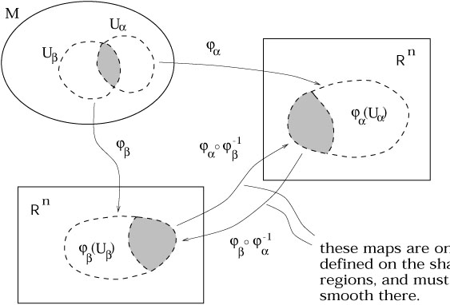

Manifold
========

### Note
[Tensor index notation](tensors.md) will be used in this document.
    

A manifold captures the notion of a space which may have a complicated global topology, but locally resembles Euclidean space $\mathbb{R}^n$. 

<!-- Wow, these resources: https://ned.ipac.caltech.edu/level5/March01/Carroll3/Carroll2.html 
http://bjlkeng.github.io/posts/manifolds/
-->

    
Some Definitions
----------------
Map $\phi\colon M\rightarrow N$
 ~ A relationship which assigns for $\forall\,m\in M$ *at least* one element $n\in N$. (Hence, in some definitions a function is a map which assigns to *only* one element in $N$).

Composition $\psi\circ\phi\colon M\rightarrow W$
 ~ The operation defined by $(\psi\circ\phi)a = \psi(\phi(a))$ for $\psi\colon N\rightarrow W$.
 
Injective
 ~ A one-to-one mapping such that $\forall\, n\in N$ there is *at most* one element of $M$ mapped onto $n$.  
 E.g. $y=x^3-x$ is not injective, as $y(1) = y(-1)$.
 
Surjective
 ~ A one-to-one mapping such that $\forall\, n\in N$ there is *at least* one element of $M$ mapped onto $n$.  
 E.g. $y=e^x$ is not surjective, as $\nexists n\in N:y(n)=-1$.

Bijective
 ~ A map which is both injective and surjective. Also known as *invertible*, i.e. there exists an *inverse map* $\phi^{-1}\colon N\rightarrow M$ such that $(\phi^{-1}\circ\phi)(a) = a$.

Continuity
~ A map $\mathbb{R}^m\rightarrow\mathbb{R}^n\colon$ is $C^p$ if each of its component functions are $C^p$. I.e. if the image of $\phi$ is given by $y^i = \phi^i(x^1,x^2,\dots,x^m)$, then each $y^i$ is continuous and at least $p$ times differentiable (where the $p$ derivatives themselves are continuous). $C^\infty$ maps are referred to as *smooth*. 

Diffeomorphic
 ~ Two sets $M$ and $N$ are *diffeomorphic* if there exists a $C^\infty$ map $\phi\colon M \rightarrow N$ with a $C^\infty$ inverse $\phi^{-1}\colon N \rightarrow M$. The map $\phi$ is then called a *diffeomorphism*.
  
Homeomorphic
 ~ Two sets $M$ and $N$ are *homeomorphic* if there exists a $C^0$ map $\phi\colon M \rightarrow N$ with a $C^0$ inverse $\phi^{-1}\colon N \rightarrow M$. The map $\phi$ is then called a *homeomorphism*. 
  
$n$-Sphere
 ~  The generalization of the ordinary sphere to spaces of arbitrary dimension $n+1$. E.g. the ordinary sphere is a 2-sphere embedded in 3 dimensional Euclidean space.

Open Ball
 ~ The set of all points contained within the *interior* of an $n$-Sphere centered at $\vb{y}$, i.e. $\set{x}:x \in \mathbb{R}^n,\,\abs{\vb{x}-\vb{y}}<r$ for some $\vb{y}\in \mathbb{R}^n$ and $r\in \mathbb{R}$, where $\abs{\vb{x}-\vb{y}}=\sqrt{\sum_I(x^i-y^i)^2}$. 
    
Open Set
 ~ An open set in $\mathbb{R}^n$ is a set constructed from an arbitrary union of open balls. That is, for if $V \subset \mathbb{R}^n$ is open, for any $y \in V$ there exists an open ball centered at $y$ which is completely inside $V$. It is the *interior* of some (n-1) dimensional closed surface, or the union of several such interiors.
    
Chart
 ~ A chart or *coordinate system* consists of a subset $U\subset M$, along with a homeomorphic map $\phi\colon U\rightarrow \mathbb{R}^n$ such that *the image $\phi(U)$ is open in $\mathbb{R}^n$*. It can then be said that $U$ is an *open set in $M$*. $\phi$ is a diffeomorphism, which follows from the fact that it is homeomorphic, and both $\phi$ and $\phi^{-1}$ are smooth.[^lu]
    
$C^p$ atlas
 ~ An indexed collection of charts $\set{(U_\alpha,\phi_\alpha)}$, with the index denoted by $\alpha$, which satisfies the following conditions:
  1. The union of $\set{U_\alpha}$ is equal to $M$; $U_\alpha$ cover $M$.
  1. The charts are smoothly sewn together; if two charts $U_\alpha$ and $U_\beta$ overlap, i.e. $U_\alpha \cap U_\beta \neq \emptyset$, then the transition map $\phi_\alpha \circ \phi_\beta^{-1}$ takes points in $\phi_\beta(U_\alpha\cap U_\beta)\subset \mathbb{R}^n$ onto $\phi_\alpha(U_\alpha\cap U_\beta)\subset \mathbb{R}^n$,[^8] and all of these maps must be $C^p$ where they are defined.
 [^9]
    
$C^p$ $n$-dimensional manifold ($n$-manifold)
 ~ A set $M$ along with a "maximal atlas" (one that contains every possible compatible chart).

Example $2$-Sphere
-------------------
One might imagine that the $2$-sphere (conventional sphere) might need only two charts to form an atlas, by splitting it along the plane $z=0$. This is not the case[^10], because each chart requires an open set, which in turn is defined for unions of open balls. These open balls require $d(\vb{x},\vb{y})<r$, not $d(\vb{x},\vb{y})\leq r$, and thus in splitting the sphere along $z=0$ there is a locus of points ($x^2+z^2=r^2$, $z=0$) from which maps neither chart. Similarly, defining additional charts by splitting along the plane $x=0$, leaves the equatorial points with $x=0$ and $z=0$ unmapped. It is for this reason that the 2-Sphere requires $6$ charts to form an atlas.

Metric Generalises the Dot Product
----------------------------------
Recall that in order for distances and angles to be measured on a vector space, it must be an [inner product space](inner-product-space.md). In order to measure these quantities on a manifold, it follows that each tangent space must be equipped with an inner product, and this inner product *must vary smoothly* from point to point.[^5] The two classes of manifolds with this property are called [Riemannian manifolds](https://en.wikipedia.org/wiki/Riemannian_manifold) and [Hermitian manifolds](https://en.wikipedia.org/wiki/Hermitian_manifold), corresponding to real and complex manifolds respectively.

### The Metric $g_{ij}$
The inner product on Riemannian manifolds may be writen in terms of the *Riemannian metric* $g_{ij}$
$$
\tag{2}
\ip{\vb{u}}{\vb{v}} = g_{ij}u^iv^j\,.
$$
The Riemannian metric is symmetric, i.e. $g_{ij} = g_{ji}$. There exists an *inverse* metric $g^{ij}$, such that
$$
g^{ik}g_{kj} = \delta^i_j\,.
$$
Evidently for Cartesian coordinates on Euclidean space, $\ip{\vb{u}}{\vb{v}}=\vb{u}\cdot\vb{v}$ and so $g_{ij} = \delta_{ij}$.

We can write a vector $\vb{v}$ in terms of three linearly independent basis vectors $\set{\vb{e}_i}$ as
$$
\vb{v} = v^i\vb{e}_i\,,
$$
hence the inner product between any two vectors $\vb{u}$ and $\vb{v}$ is
$$
\tag{3}
\begin{aligned}
\ip{\vb{u}}{\vb{v}} 
&= \ip{u^i\vb{e}_i}{\vb{v}}\\
&= u_i\ip{\vb{e}_i}{v_i\vb{e}_j}\\
&= u_iv_i\ip{\vb{e}_i}{\vb{e}_j}\\
\end{aligned}\,.
$$
Comparing **(2)** with **(3)** it follows that $g_{ij} = \ip{\vb{e}_i}{\vb{e}_j}$. The metric can then be used to construct the *line element*
$$
{\dd s}^2 = \ip{\dd x}{\dd x} = g_{ij}\dd x^i \dd x^j\,.
$$

Given the linear functional on the tangent space $\phi_\vb{u}(\vb{v})=\ip{\vb{u}}{\vb{v}}$, 

[^2]: Note that often indices are implicit in the function arguments, that is $f(x)\equiv f(x^a)$.
[^3]: In E.S.C the index $i$ in a partial derivative $\pdv{}{x^i}$ is treated as though it were a *lowered index*.
[^4]: https://math.stackexchange.com/questions/1588854/use-of-partial-derivatives-as-basis-vector
[^5]: https://en.wikipedia.org/wiki/Manifold#Riemannian_manifolds
[^6]: The notation $f(x^a)$ represents $f(x^l,x^m,\dots,x^w)$ for some $l,m,\dots,w$
[^7]: This defines any vector $\vec{v}$ (in the tangent space) as a *functional* on the tangent space.
[^8]: That is, if two subsets of $M$ intersect, the map $\phi_\alpha\circ\phi_\beta^{-1}$ takes points from one ($\alpha$) Euclidean space of their intersection to the other ($\beta$).
[^9]: https://ned.ipac.caltech.edu/level5/March01/Carroll3/Carroll2.html
[^10]: https://math.stackexchange.com/questions/54643/why-not-just-2-charts-to-make-atlas-for-sphere
[^11]: This shorthand (informal) notation is unambiguous and thus allowed: $x^\mu$ belongs to $\mathbb{R}^n$, and thus implies $f=\comp{f}{\phi^{-1}}$.
[^12]: An Introduction to Manifolds, p.95