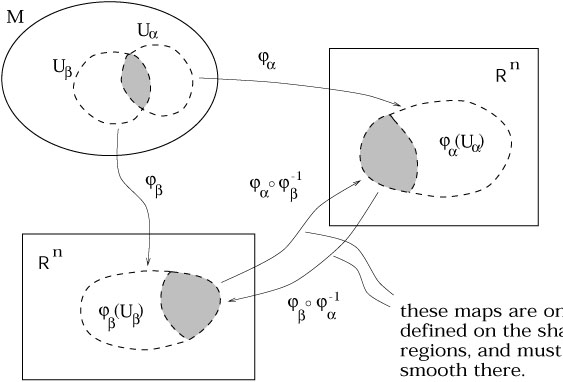

Manifold
========

### Note
[Tensor index notation](tensors.md) will be used in this document.
    

A manifold captures the notion of a space which may have a complicated global topology, but locally resembles Euclidean space $\mathbb{R}^n$. 

<!-- Wow, these resources: https://ned.ipac.caltech.edu/level5/March01/Carroll3/Carroll2.html 
http://bjlkeng.github.io/posts/manifolds/
-->
<!--

    
Some Definitions
----------------
Map $\phi\colon M\rightarrow N$
 ~ A relationship which assigns for $\forall\,m\in M$ *at least* one element $n\in N$. (Hence, in some definitions a function is a map which assigns to *only* one element in $N$).

Composition $\psi\circ\phi\colon M\rightarrow W$
 ~ The operation defined by $(\psi\circ\phi)a = \psi(\phi(a))$ for $\psi\colon N\rightarrow W$.
 
Injective
 ~ A one-to-one mapping such that $\forall\, n\in N$ there is *at most* one element of $M$ mapped onto $n$.  
 E.g. $y=x^3-x$ is not injective, as $y(1) = y(-1)$.
 
Surjective
 ~ A one-to-one mapping such that $\forall\, n\in N$ there is *at least* one element of $M$ mapped onto $n$.  
 E.g. $y=e^x$ is not surjective, as $\nexists n\in N:y(n)=-1$.

Bijective
 ~ A map which is both injective and surjective. Also known as *invertible*, i.e. there exists an *inverse map* $\phi^{-1}\colon N\rightarrow M$ such that $(\phi^{-1}\circ\phi)(a) = a$.

Continuity
~ A map $\mathbb{R}^m\rightarrow\mathbb{R}^n\colon$ is $C^p$ if each of its component functions are $C^p$. I.e. if the image of $\phi$ is given by $y^i = \phi^i(x^1,x^2,\dots,x^m)$, then each $y^i$ is continuous and at least $p$ times differentiable (where the $p$ derivatives themselves are continuous). $C^\infty$ maps are referred to as *smooth*. 

Diffeomorphic
 ~ Two sets $M$ and $N$ are *diffeomorphic* if there exists a $C^\infty$ map $\phi\colon M \rightarrow N$ with a $C^\infty$ inverse $\phi^{-1}\colon N \rightarrow M$. The map $\phi$ is then called a *diffeomorphism*.
  
Homeomorphic
 ~ Two sets $M$ and $N$ are *homeomorphic* if there exists a $C^0$ map $\phi\colon M \rightarrow N$ with a $C^0$ inverse $\phi^{-1}\colon N \rightarrow M$. The map $\phi$ is then called a *homeomorphism*. 
  
$n$-Sphere
 ~  The generalization of the ordinary sphere to spaces of arbitrary dimension $n+1$. E.g. the ordinary sphere is a 2-sphere embedded in 3 dimensional Euclidean space.

Open Ball
 ~ The set of all points contained within the *interior* of an $n$-Sphere centered at $\vb{y}$, i.e. $\set{x}:x \in \mathbb{R}^n,\,\abs{\vb{x}-\vb{y}}<r$ for some $\vb{y}\in \mathbb{R}^n$ and $r\in \mathbb{R}$, where $\abs{\vb{x}-\vb{y}}=\sqrt{\sum_I(x^i-y^i)^2}$. 
    
Open Set
 ~ An open set in $\mathbb{R}^n$ is a set constructed from an arbitrary union of open balls. That is, for if $V \subset \mathbb{R}^n$ is open, for any $y \in V$ there exists an open ball centered at $y$ which is completely inside $V$. It is the *interior* of some (n-1) dimensional closed surface, or the union of several such interiors.
    
Chart
 ~ A chart or *coordinate system* consists of a subset $U\subset M$, along with an injective map $\phi\colon U\rightarrow \mathbb{R}^n$ such that *the image $\phi(U)$ is open in $\mathbb{R}^n$*. It can then be said that $U$ is an *open set in $M$*.
    
$C^p$ atlas
 ~ An indexed collection of charts $\set{(U_\alpha,\phi_\alpha)}$, with the index denoted by $\alpha$, which satisfies the following conditions:
  1. The union of $\set{U_\alpha}$ is equal to $M$; $U_\alpha$ cover $M$.
  1. The charts are smoothly sewn together; if two charts $U_\alpha$ and $U_\beta$ overlap, i.e. $U_\alpha \cap U_\beta \neq \emptyset$, then the transition map $\phi_\alpha \circ \phi_\beta^{-1}$ takes points in $\phi_\beta(U_\alpha\cap U_\beta)\subset \mathbb{R}^n$ onto $\phi_\alpha(U_\alpha\cap U_\beta)\subset \mathbb{R}^n$,[^8] and all of these maps must be $C^p$ where they are defined.
 [^9]
    
$C^p$ $n$-dimensional manifold ($n$-manifold)
 ~ A set $M$ along with a "maximal atlas" (one that contains every possible compatible chart).

Example $2$-Sphere
-------------------
One might imagine that the $2$-sphere (conventional sphere) might need only two charts to form an atlas, by splitting it along the plane $z=0$. This is not the case[^10], because each chart requires an open set, which in turn is defined for unions of open balls. These open balls require $d(\vb{x},\vb{y})<r$, not $d(\vb{x},\vb{y})\leq r$, and thus in splitting the sphere along $z=0$ there is a locus of points ($x^2+z^2=r^2$, $z=0$) from which maps neither chart. Similarly, defining additional charts by splitting along the plane $x=0$, leaves the equatorial points with $x=0$ and $z=0$ unmapped. It is for this reason that the 2-Sphere requires $6$ charts to form an atlas.
-->

Contravariant (Tangent) Vectors
-------------------------------
### Chain Rule of Composed Functions
Consider the maps $f\colon \mathbb{R}^m\rightarrow\mathbb{R}^n$, and $g\colon \mathbb{R}^n\rightarrow\mathbb{R}^l$ such that $\comp{g}{f}\colon\mathbb{R}^m\rightarrow\mathbb{R}^l$. Let us define the points in each space in terms of the components $x^a$ on $\mathbb{R}^m$, $y^b$ on $\mathbb{R}^n$, and $z^c$ on $\mathbb{R}^l$.
The chain rule for function composition is then given by
$$
\begin{aligned}
\pdv{}{x^a}(\comp{g}{f})^c=\sum_b \pdv{f^b}{x^a}\pdv{g^c}{y^b}\,,
\end{aligned}
$$
which is abbreviated to 
$$
\pdv{}{x^a} = \sum_b\pdv{y^b}{x^a}\pdv{}{y^b}\,.
$$
Note that when $m=n$, $\pdv{y^b}{x^a}$ are elements of the Jacobian matrix of $\comp{g}{f}$. 
<!-- TODO why does the NONZERO Jacobian make g(f(x)) invertible? -->

### Differential Operators as Vectors
For an $n$-manifold $M$, let $\gamma(\lambda)\colon R\rightarrow M$ be a curve which passes through point $\vb{p}$, $\phi\colon M\rightarrow \mathbb{R}^n$ a coordinate chart, and $f\colon M\rightarrow R$ a scalar function. The derivative of $f$ with respect to $\lambda$ is
$$
\begin{aligned}
\dv{f}{\lambda} 
&= \pdv{}{\lambda}(\comp{f}{\gamma})\\
&= \pdv{}{\lambda}\comp{(\comp{f}{\phi^{-1}})}{(\comp{\phi}{\gamma})}\,.
\end{aligned}
$$
From the chain rule,
$$
\begin{aligned}
\dv{f}{\lambda} 
&= \pdv{\left(\comp{\phi}{\gamma}\right)^\mu}{\lambda}\pdv{(\comp{f}{\phi^{-1}})}{x^\mu}\\
&= \dv{x^\mu}{\lambda}\partial_\mu f\,,
\end{aligned}
$$
where 
$$
\tag{1}
\left(\comp{\phi}{\gamma}\right)^\mu=x^\mu
$$ and[^11] $$\pdv{(\comp{f}{\phi^{-1}})}{x^\mu}=\partial_\mu f\,.$$ From this derivation for arbitrary $f$, it follow that we have
$$
\pdv{}{\lambda} = \dv{x^\mu}{\lambda}\partial_\mu\,.
$$
Hence, it can be seen that $\partial_\mu$ form a basis for the directional derivatives of *all* curves through $\vb{p}$ (with the coordinates $\dv{x^\mu}{\lambda}$ particular to a given curve $\gamma(\lambda)$). This vector space is called the [*tangent space*](https://en.wikipedia.org/wiki/Tangent_space#Definition_via_derivations) of the manifold at the point $\vb{p}\in M$, written as $T_pM$. 

It should be noted that $\pdv{}{\lambda}$ is defined as the natural directional derivative for some curve $\gamma(\lambda)$. It is a member of the more general class of directional derivatives on $D_vf(\vb{p})\in T^*_pM$, where $$T^*_pM\colon T_pM\rightarrow \mathbb{R}$$ is the dual of $T_pM$. 

For some $\vec{v}\in M$, we may then define 
$$
    D_\vb{v} = \pdv{\left(\comp{\phi}{\gamma_v}\right)^\mu}{\lambda}\partial_u\,,
$$
for some $\gamma_\vb{v}$ such that 
$$\begin{matrix}\gamma_\vb{v}(0) = \vb{p} & \gamma_\vb{v}\end{matrix}$$
[^12].

* If we define directional derivative as limit then it requires euclidean ambient space?
* Seems that ambient space $\equiv$ embedding. 
* If $M\subset \mathbb{R}^n$ then it's not an abstract manifold.

---
DiffGeo.pdf:
* p.36 tangent space euclidean
* p.48: 
  >Starting with topological manifolds, which
are Hausdorff, second countable, locally Euclidean spaces, we introduce the concept
of a maximal C ∞ atlas, which makes a topological manifold into a smooth manifold.
* p.80: Define "The Intrinsic Definition of a Manifold"
* p.87: Defines $\dot{\gamma}$ in terms of $\phi_\alpha$.
  * Seems to equate $\dot{\gamma}\in T_pM$ with $\left[\alpha,\dv{}{t}\Big|_{t=0}\phi_a(\gamma(t))\right]$, and then establishes equivalence class within $\phi_\alpha$ space. I.e., $\dot{\gamma}$ is the vector $\in T_pM$ which corresonds to $\left[\alpha,\dv{}{t}\Big|_{t=0}\phi_a(\gamma(t))\right]$
  * Need to think about 2.8.18 more carefully.
* p.104: 
  >The Whitney Embedding Theorem asserts that every second count-able Hausdorff m-manifold M admits an embedding f : M → R 2m .

l-Tu:
* > Topological Manifolds are Hausdorff, second countable, locally Euclidean spaces
* p.86 The Tangent Space (Seems to be abstract manifolds).

Lee:
* p.62 tangent vectors outside of $R^n$ 
  > The problem with this definition, however, is that it gives us no clue as
to how we might set about defining tangent vectors on an arbitrary smooth
manifold, where there is no ambient Euclidean space.

[Wikipedia](https://en.wikipedia.org/wiki/Topological_manifold) :
* > Manifolds are also commonly required to be second-countable. This is precisely the condition required to ensure that the manifold embeds in some finite-dimensional Euclidean space.

[Mathworld](http://mathworld.wolfram.com/TopologicalManifold.html):
* Every smooth manifold is a topological manifold,

An equivalence class is the set of all $x \in S$ which satisfy $x \sim a$, that is
$$
\set{x \in S : x \sim a}\,,
$$
where $x\sim a$ is defined as the equivalence relation. The equivalence relation satisfies the following three properties
|     Name     	|                                  Definition                                  	|
|:------------:	|:----------------------------------------------------------------------------:	|
|  Reflexivity 	|                         $\forall\, a \in X,\,a\sim a$                        	|
|   Symmetry   	|                    $\forall\,a,b\in X,a\sim b\iff b\sim a$                   	|
| Transitivity 	| $\forall\, a,b,c\in X,\text{ if }a\sim b \land b\sim c \text{ then }a\sim c$ 	|

Let us define two curves $\gamma_0$ and $\gamma_1$, where $\gamma_0(0)=\gamma_1(0)$, to be $p$-equivalent if $\forall\,\alpha\in A$,
$$
\dv{}{t}\bigg|_{t=0}\phi\mleftright{(}{\gamma_0(t)}{)} = \dv{}{t}\bigg|_{t=0}\phi\mleftright{(}{\gamma_1(t)}{)} \,.
$$
We can denote the equivalence class of a smooth curve $\gamma\colon \mathbb{R}\rightarrow M$ with $\gamma(0)=\vb{p}$ as $[\gamma]_\vb{p}=\set{\gamma_i:\gamma_0\overset{p}{\sim} \gamma_i}$.

https://people.math.ethz.ch/~salamon/PREPRINTS/diffgeo.pdf

---

### Other Notes

<!-- TODO link directional derivative -->

Given a manifold $M$ in $\mathbb{R}^N$, with a curve defined by $x^i = x^i(t)$. At every point $x^i$ there exists a [vector space](vector-space.md) (the [*tangent* space](https://en.wikipedia.org/wiki/Tangent_space)) in which an arbitrary vector may be represented. This tangent space varies from point to point. There are several definitions of the tangent space, including [the velocity of curves](https://en.wikipedia.org/wiki/Tangent_space#Definition_as_the_velocity_of_curves) and [derivatives](https://en.wikipedia.org/wiki/Tangent_space#Definition_via_derivations).

Consider the directional derivative $\grad_vf(x^a)\colon M\rightarrow \mathbb{R}$ of a curve $f(x^a)$, where $x^a$ represent Cartesian coordinates on Euclidean space.[^2] Removing the function from the equation, we have in E.S.C[^3]
$$
\tag{2}
\begin{aligned}
    \grad_v = \vu{v}\cdot\grad 
    &= v^i\pdv{}{x^i}\\
    &= v^1\pdv{}{x^1} + v^2\pdv{}{x^2} + v^3\pdv{}{x^3}\,.
\end{aligned}    
$$
If we define $\grad_u$ such that
* $(\grad_u+\grad_v)(f)=\grad_u(f)+\grad_v(f)$
* $(\lambda \grad_u)f = \lambda \grad_u(f)$,

then $\grad_u$ form a vector space according to the axioms. 
Note that earlier we demonstrated that derivatives of scalar functions are *covectors*, rather than classical vectors. Hence, the members of the tangent space are *covectors*.

Evidently, given **(2)**, we can find a basis in this vector space at any point $x'$ as $\pdv{}{x^i}\Big|_{x'}$. If we let 
$$
    v(\cdot) = \vu{v}\cdot\grad\,,
$$
then it follows that[^7]
$$
    v(x^i) = \vu{v}\cdot\grad x^i = v^i\,.
$$
A final remark is that the derivative of a scalar function $\phi(x^a(t))$[^6] with respect to $t$ is a vector in this space:
$$
\begin{aligned}
\dv{\phi(x^a(t))}{t} 
&= \dv{x^i}{t}\pdv{\phi}{x^i}\\
&= v^i\pdv{\phi}{x^i}\,,
\end{aligned}
$$
where $\dv{x^i}{t}$ is the tangent vector $v^i$ to the curve $x^i(t)$ by definition.

Metric Generalises the Dot Product
----------------------------------
Recall that in order for distances and angles to be measured on a vector space, it must be an [inner product space](inner-product-space.md). In order to measure these quantities on a manifold, it follows that each tangent space must be equipped with an inner product, and this inner product *must vary smoothly* from point to point.[^5] The two classes of manifolds with this property are called [Riemannian manifolds](https://en.wikipedia.org/wiki/Riemannian_manifold) and [Hermitian manifolds](https://en.wikipedia.org/wiki/Hermitian_manifold), corresponding to real and complex manifolds respectively.

### The Metric $g_{ij}$
The inner product on Riemannian manifolds may be writen in terms of the *Riemannian metric* $g_{ij}$
$$
\tag{2}
\ip{\vb{u}}{\vb{v}} = g_{ij}u^iv^j\,.
$$
The Riemannian metric is symmetric, i.e. $g_{ij} = g_{ji}$. There exists an *inverse* metric $g^{ij}$, such that
$$
g^{ik}g_{kj} = \delta^i_j\,.
$$
Evidently for Cartesian coordinates on Euclidean space, $\ip{\vb{u}}{\vb{v}}=\vb{u}\cdot\vb{v}$ and so $g_{ij} = \delta_{ij}$.

We can write a vector $\vb{v}$ in terms of three linearly independent basis vectors $\set{\vb{e}_i}$ as
$$
\vb{v} = v^i\vb{e}_i\,,
$$
hence the inner product between any two vectors $\vb{u}$ and $\vb{v}$ is
$$
\tag{3}
\begin{aligned}
\ip{\vb{u}}{\vb{v}} 
&= \ip{u^i\vb{e}_i}{\vb{v}}\\
&= u_i\ip{\vb{e}_i}{v_i\vb{e}_j}\\
&= u_iv_i\ip{\vb{e}_i}{\vb{e}_j}\\
\end{aligned}\,.
$$
Comparing **(2)** with **(3)** it follows that $g_{ij} = \ip{\vb{e}_i}{\vb{e}_j}$.

Given the linear functional on the tangent space $\phi_\vb{u}(\vb{v})=\ip{\vb{u}}{\vb{v}}$, 

[^2]: Note that often indices are implicit in the function arguments, that is $f(x)\equiv f(x^a)$.
[^3]: In E.S.C the index $i$ in a partial derivative $\pdv{}{x^i}$ is treated as though it were a *lowered index*.
[^4]: https://math.stackexchange.com/questions/1588854/use-of-partial-derivatives-as-basis-vector
[^5]: https://en.wikipedia.org/wiki/Manifold#Riemannian_manifolds
[^6]: The notation $f(x^a)$ represents $f(x^l,x^m,\dots,x^w)$ for some $l,m,\dots,w$
[^7]: This defines any vector $\vec{v}$ (in the tangent space) as a *functional* on the tangent space.
[^8]: That is, if two subsets of $M$ intersect, the map $\phi_\alpha\circ\phi_\beta^{-1}$ takes points from one ($\alpha$) Euclidean space of their intersection to the other ($\beta$).
[^9]: https://ned.ipac.caltech.edu/level5/March01/Carroll3/Carroll2.html
[^10]: https://math.stackexchange.com/questions/54643/why-not-just-2-charts-to-make-atlas-for-sphere
[^11]: This shorthand (informal) notation is unambiguous and thus allowed: $x^\mu$ belongs to $\mathbb{R}^n$, and thus implies $f=\comp{f}{\phi^{-1}}$.
[^12]: An Introduction to Manifolds, p.95