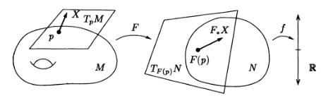

The Tangent Space
=================
> A basic principle in manifold theory is the linearization principle, according to
which a manifold can be approximated near a point by its tangent space at the point,
and a smooth map can be approximated by the differential of the map[^lu]

> The collection of tangent spaces to a manifold can be given the structure of a
vector bundle; it is then called the tangent bundle of the manifold. Intuitively, a
vector bundle over a manifold is a locally trivial family of vector spaces parametrized by points of the manifold.[^lu]

<!-- TODO p.77 Lee mentions germs. We use them here without necessarily being rigorous about them (wherever Lee and Lu notes mix)-->

Chain Rule of Composed Functions on $\mathbb{R}^m$
--------------------------------------------------
Consider the maps $f\colon \mathbb{R}^m\rightarrow\mathbb{R}^n$, and $g\colon \mathbb{R}^n\rightarrow\mathbb{R}^l$ such that $\comp{g}{f}\colon\mathbb{R}^m\rightarrow\mathbb{R}^l$. Let us define the points in each space in terms of the components $x^a$ on $\mathbb{R}^m$, $y^b$ on $\mathbb{R}^n$, and $z^c$ on $\mathbb{R}^l$.
The chain rule for function composition is then given by
$$
\begin{aligned}
\pdv{}{x^a}(\comp{g}{f})^c=\sum_b \pdv{f^b}{x^a}\pdv{g^c}{y^b}\,,
\end{aligned}
$$
which is abbreviated to 
$$
\pdv{}{x^a} = \sum_b\pdv{y^b}{x^a}\pdv{}{y^b}\,.
$$
Note that when $m=n$, $\pdv{y^b}{x^a}$ are elements of the [Jacobian matrix](../integration-by-substitution.md#Multiple-Variables) of $\comp{g}{f}$. 
<!-- TODO why does the NONZERO Jacobian make g(f(x)) invertible? -->

Tangent Vectors in $\mathbb{R}^n$
---------------------------------
At a given point $\vb{p}$ on a surface in $\mathbb{R}^n$, there exists a vector space formed of the tangent vectors at $\vb{p}$. 

In order to generalise this space to abstract manifolds (those not embedded in a (Euclidean) space), one can use the notion of the directional derivative which isomorphic to the geometric tangent space defined above. It can then be shown that these derivations generalise to abstract manifolds.

$\gdef\TpRn{T_\vb{p}\mathbb{R}^n}$

Let us define the [set](../set.md) of curves $\set{\vb{v}_i}$ at a point $\vb{p}$ as the tangent space $\TpRn$ of $\vb{p}$. The *directional derivative* is defined for some $f\colon \mathbb{R}^n\rightarrow\mathbb{R}$ in $C^\infty_\vb{p}$ on this space as
$$
\begin{aligned}
D_\vb{v}f 
&= \lim_{t\rightarrow 0}\frac{f(\vb{p}+t\vb{v})-f(\vb{p}))}{t}\\
&= \dv{f(\vb{c}(t))}{t}\Big|_{t=0}\,,
\end{aligned}
$$
where $\vb{c}(t) = \vb{p} + t\vb{v}$. From the chain rule, we have
<!-- TODO: A little liberal switching from total to partials here. Justify -->
$$
\begin{aligned}
D_\vb{v}f 
&= \sum_i\pdv{c^i}{t}\bigg|_{0}\pdv{f}{x^i}\bigg|_{p}\\
&= v^i\pdv{f}{x_i}\bigg|_{p}\,,
\end{aligned}
$$
where we have dropped the explicit sum as it is implied by the index notation (over $i$). It follows that we can write $D_\vb{v}$ as
$$
D_\vb{v} = v^i\pdv{}{x_i}\,,
$$
where we have also dropped the subscript $\vb{p}$.
It can be seen that $D_\vb{v}$ form a [vector space](vector-space.md):
$$
\begin{aligned}
D_\vb{u} + D_\vb{v} &= \sum_i (u^i+v^i)\pdv{f}{x^i} = D_{\vb{u}+\vb{v}}\\
aD_\vb{u} &= \sum_i a(u^i)\pdv{f}{x^i} = D_{a\vb{u}}\,,
\end{aligned}
$$
with the axioms of distributivity and identity left implied. The basis vectors of this space are 
$$
\vb{e}_i = \pdv{}{x^i}\,.
$$

Derivations at a Point in $\mathbb{R}^n$
----------------------------------------
$\gdef\DpRn{\mathcal{D}_\vb{p}\mathbb{R}^n}$
Any linear map $D\colon C_\vb{p}^\infty\rightarrow \mathbb{R}$ which satisfies the Leibniz rule
$$
\tag{1}
D(fg) = (Df)g(\vb{p}) + f(\vb{p})(Dg)
$$
is called a *[derivation](https://en.wikipedia.org/wiki/Derivation_(differential_algebra)) at $\vb{p}$*, or equally a *point derivation of $C^\infty$*. Let us define the set of all derivations $D$ at $\vb{p}$ as $\DpRn$. Evidently, $D_\vb{v} \in \DpRn$, as the partial derivatives satisfy the Liebniz rule.

We can define a map $\Omega\colon \TpRn\rightarrow\DpRn$ from the geometric tangent space to the derivation space
$$
\Omega(\vb{v})\colon \vb{v}\mapsto D_\vb{v}\,,
$$
which is clearly linear, as $D_\vb{v}$ is linear in $\vb{v}$. At this point, it is not yet determined whether *every* derivation at $\vb{p}$ is a directional derivative.
We have some properties that can be inferred from **(1)**:

### If $D \in \DpRn$, then $D(c)=0$ for any constant function $c$.
From the Leibniz rule, given that derivations have $\mathbb{R}$-linearity and thus $D(c)=cD(1)$,
$$
D(1) = D(1\cdot 1) = D(1)\cdot 1 + 1\cdot D(1) = 2D(1)\,,
$$
it follows that $D(1) = D(c) = 0$.

### The linear map $\Omega\colon \TpRn\rightarrow \DpRn$ is an isomorphism of vector spaces.
Isomorphism
~ A linear transformation $T$ from a vector space $V$ to a vector space $W$ is called an isomorphism of vector spaces if $T$ is both *injective* and *surjective*.
    
Let us suppose that $D_\vb{v}=0$ for $\vb{v}\in\TpRn$. Applying $D_\vb{v}$ to the coordinate function $x^j$ gives
$$
0 = D_\vb{v}(x^j) = \sum_iv^i\pdv{x_j}{x^i}\bigg|_\vb{p}=v^j\,.
$$    

Injectivity[^shankar]
~ A linear operator $T$ is injective iff. $\operatorname{null} T = \set{0}$, where $\operatorname{null}T=\set{v \in V : T v=0}$.
That is, if the only vector mapped to $0$ is $0$ itself, then $T$ is one-to-one.
    
From this definition of *injectivity*, it follows that $\Omega$ is injective. 
$\gdef\CpRn{C_p^\infty(\mathbb{R}^n)}$ 
To prove surjectivity, let $D\in\DpRn$ be arbitrary. Let $(f,V)$ be representative of a germ in $\CpRn$.     
    
[Germ](https://en.wikipedia.org/wiki/Germ_(mathematics))
 ~ An [equivalence class](../equivalence-class.md) of an object on a topological space and others of the same kind which captures their shared local properties.   

$\CpRn$
~ We define the *germ* of a $C^\infty$ function at $\vb{p}\in \mathbb{R}^n$ as an *equivalence class* of $C^\infty$ functions defined in a neighbourhood of $\vb{p}\in \mathbb{R}^n$. Two functions are equivalent *if they agree on some possibly smaller neighbourhood of $\vb{p}$*. The set of germs of $C^\infty$ real-valued functions at $\vb{p}\in \mathbb{R}^n$ (i.e. the [*quotient set*](../equivalence-class.md)) is denoted by $\CpRn$. The addition and multiplication of functions make $\CpRn$ a [ring](../ring.md). With scalar multiplication by $x\in\mathbb{R}$, it [becomes an algebra](https://en.wikipedia.org/wiki/Associative_algebra#Definition).
    
    
Making $V$ smaller if required such that it is an open ball, by Taylor’s theorem with remainder[^lu], there are functions $g_i(\vb{x}) \in C^\infty$ in the neighbourhood of $\vb{p}$ such that 
$$
\begin{matrix}
f(\vb{x}) = f\vb{p}) + \sum_i(x^i-p^i)g_i(\vb{x})\,, &
g_i(\vb{x}) = \pdv{f}{x^i}(\vb{p})\,.
\end{matrix}
$$
Applying $D$ to both sides, noting that $D(c)=0$, **(1)** gives
$$
\begin{aligned}
Df(\vb{x}) &= \sum_i(Dx^i)g_i(\vb{p})+\sum_i(p^i-p^i)Dg_i(\vb{x})\\
&=\sum_i(Dx^i)\pdv{f}{x^i}(\vb{p})\\
&=\sum_iv^i\pdv{f}{x^i}(\vb{p})=D_\vb{v}f(\vb{x})\,,
\end{aligned}
$$
for some vector $v^i=Dx^i$. In other words, $D$ can be represented as a directional derivative. It follows that we have a vector space of functionals $\DpRn$ that is *isomorphic* to the geometrical space of tangent vectors $\TpRn$, i.e. $\TpRn\cong\DpRn$. Under this isomorphism, $\TpRn$ has a basis $\set{\pdv{}{x^i}\big|_p}$.

The Tangent Space at a Point
----------------------------
$\gdef\CpM{C^\infty_\vb{p}(M)}$

As with $\mathbb{R}^n$, we define a *germ* of a $C^\infty$ function at $\vb{p}\in M$ to be $\CpM$. Generalising the point derivation in $\mathbb{R}^n$, we may define a *point-derivation* of some function $f\in \CpM$ to be a linear map $D\colon \cpm\rightarrow \mathbb{R}$ such that
$$
\tag{2}
D(fg) = (Df)g(\vb{p}) + f(\vb{p})Dg\,.
$$
$\gdef\TpM{T_\vb{p}M}$
The set $\TpM$ of all derivations of $\CpM$ is a vector space called the *tangent space* at $\vb{p}$. Here, we *define* a derivation as a tangent vector in the abstract sense. Note that, if we have an open set $U\subset M$, then the algebra $C_p^\infty(U)$ is *the same* as $\CpM$[^lu]. 

Pushforwards
------------
<!-- TLDR pushforwards are just LHS syntax for the RHS-->
$$
\gdef\TpN{T_\vb{p}N}
\gdef\TFpM{T_{F(\vb{p})}M}
$$
Let $F\colon N\rightarrow M$ be a $C^\infty$ map between two manifolds.  At each point $\vb{p}\in N$, the map $F$ induces a linear map of tangent spaces called its *differential* or *pushforward* at $\vb{p}$,
$$
F_*\colon \TpN\rightarrow \TFpM\,.
$$
If $X_\vb{p} \in \TpN$, then $F_*(X_\vb{p})$ is the tangent vector in $\TFpM$ defined by
$$
\tag{3}
(F_*(X_\vb{p}))f = X_\vb{p}(\comp{f}{F}) \in \mathbb{R}\,,
$$
for $f\in C_{F(\vb{p})}^\infty(M)$. 

    
Note that *it is solely the RHS of **(3)*** which defines a push forward, i.e. it depends solely upon the nature (domain, codomain) of $f$, $X_\vb{p}$, and $F$.

Clearly $F_*X_\vb{p}$ is a derivation at $F(\vb{p})$ because
<!-- Here, let u=fg, then u `comp` F is trivial -->
$$
\begin{aligned}
F_*X_\vb{p}(fg) 
&= X_\vb{p}(\comp{(fg)}{F})\\
&= X_\vb{p}((\comp{f}{F})(\comp{g}{F}))\\
&= \comp{f}{F(\vb{p})}X_\vb{p}(\comp{g}{F})+\comp{g}{F(\vb{p})}X_\vb{p}(\comp{f}{F})\\
&= f\mleftright{(}{F(\vb{p})}{)}(F_*X_\vb{p})(g)+g\mleftright{(}{F(\vb{p})}{)}(F_*X_\vb{p})(f)\,,
\end{aligned}
$$
which behaves as the Leibniz rule **(1)** requires. In general, pushforwards have the following properties. Let $F$ as before:

|                                                                         Property                                                                         	|                                                                                                                                                                  Proof                                                                                                                                                                  	|
|:--------------------------------------------------------------------------------------------------------------------------------------------------------:	|:---------------------------------------------------------------------------------------------------------------------------------------------------------------------------------------------------------------------------------------------------------------------------------------------------------------------------------------:	|
|                                                       $F_*\colon \TpN \rightarrow \TFpM$ is linear                                                       	|                                       Let $Z_\vb{p} = X_\vb{p} + Y_\vb{p}$.   $$   \begin{aligned}   F_*Z_\vb{p}f    &= Z_\vb{p}(\comp{f}{F})\\   &= X_\vb{p}(\comp{f}{F}) + Y_\vb{p}(\comp{f}{F})\\   &= F_*X_\vb{p}f + F_*Y_\vb{p}f\\   F_*(aX_\vb{p})f &= aF_*X_\vb{p}f\,.   \end{aligned}   $$                                      	|
| Given $G\colon M\rightarrow P$,                                   $$(\comp{G}{F})_*=\comp{G_*}{F_*}\colon\TpN\rightarrow T_{\comp{G}{F(\vb{p})}}P$$                                     	|                                                                              $$(\comp{G}{F})_*X_\vb{p}f=X_\vb{p}(\comp{f}{\comp{G}{F}})$$   $$(\comp{G_*}{F_*})X_\vb{p}f=G_*(F_*X_\vb{p})f = (F_*X_\vb{p})(\comp{f}{G})= X_\vb{p}(\comp{\comp{f}{F}}{G})$$                                                                              	|
| $(1_M)_*=1_{\TpM}$ at any point $p\in M$, given      $$\mathbb{1}_{\TpM}\colon\TpM\rightarrow \TpM$$ 	|                                                                                                               For any $X_\vb{p}\in\TpM$ and $f\in\CpM$,   $$   ((1_M)_*X_\vb{p})f = X_\vb{p}(\comp{f}{1_M})=X_\vb{p}f   $$                                                                                                              	|
| If $F$ is a diffeomorphism, then $F_*\colon \TpN\rightarrow \TFpM$ is an isomorphism.                                                                    	| To be diffeomorphic requires the existence of a $C^\infty$ inverse $G\colon M\rightarrow  N$ such that $$\begin{matrix}\comp{G}{F}=\mathbb{1}_N\,,&\comp{F}{G}=\mathbb{1}_M\end{matrix}\,.$$ From the other properties, $$(\comp{G}{F})_*=\comp{G_*}{F_*}=(\mathbb{1}_N)=\mathbb{1}_{\TpN}$$ Similarly,$$(\comp{G}{F})_*=\comp{F_*}{G_*}=(\mathbb{1}_M)=\mathbb{1}_{\TFpM}$$  	|

Mapping the Basis Vectors from $T_{\phi(\vb{p})}\mathbb{R}^n$ to $\TpM$
--------------------------------------------------
$\gdef\TppRn{T_{\phi(\vb{p})}\mathbb{R}^n}$
Let $(U,\phi)$ be a smooth coordinate chart on $M$. As $\phi$ is diffeomorphism[^lu.89], the above property gives the result that $\phi_*$ is an isomorphism. <!-- TODO back this up more -->
As discussed earlier, $\DpRn_{\phi(\vb{p})}\cong \TppRn$ has a basis $\set{\pdv{}{x^i}\big|_{\phi(\vb{p})}}$. We can find these basis vectors in the manifold tangent space through the use of pushforwards. Given a pushforward 
$$
(\phi^{-1})_*\colon \TppRn\rightarrow\TpM\,,
$$
we can *define* the basis vectors in $\TpM$ as
$$
\tag{4}
\pdv{}{x^i}\bigg|_\vb{p}=(\phi^{-1})_*\pdv{}{x^i}\bigg|_{\phi(\vb{p})} \,.
$$
Using **(3)** to apply these basis vectors to a smooth function $f\colon U\rightarrow \mathbb{R}$, we have
$$
\pdv{}{x^i}\bigg|_\vb{p}f=\pdv{}{x^i}\bigg|_{\phi(\vb{p})}(\comp{f}{\phi}^{-1})=\pdv{\hat{f}}{x^i}(\hat{p})\,,
$$
where $\hat{f}=\comp{f}{\phi^{-1}}$ and $\hat{p}=\phi(p)$. One can therefore express a tangent vector $X_\vb{p}\in\TpM$ as a linear combination of these basis vectors. In order to determine the components, let us consider the differential of an arbitrary vector acting on some coordinate function $x^j$ on $:U$
$$
X(x^j) = \left(X^i\pdv{}{x^i}\bigg|_p\right)(x^j) = X^j\,.
$$

Tangent Vectors to Curves
-------------------------
In Euclidean space there is naturally the concept of the tangent vector to a smooth curve, whose components are given by the derivatives of the component functions of the curve. The same notion may be extended to curves in manifolds. If $M$ is a manifold, a curve in $M$ is defined to be a continuous map $\gamma\colon J\rightarrow M$, where $J\subset \mathbb{R}$ is an interval.

As with the basis vector derivations, we define 
$$
\gamma^\prime(t_0) = \gamma_*\left(\dv{}{t}\bigg|_{t_0}\right)\in T_{\gamma(t_0)}M\,,
$$
where $\gamma_*$ is the map from $T_{t_0}\mathbb{R}$ to $T_{t_0}\mathbb{M}$. It follows that acting on some $f\in\CpM$, we have
$$
\gamma^\prime(t_0)f = \gamma_*\left(\dv{}{t}\bigg|_{t_0}\right)f = \dv{}{t}\bigg|_{t_0}(\comp{f}{\gamma}) = \dv{(\comp{f}{\gamma})}{t}(t_0)\,.
$$

<!-- Property 2: this makes sense: If we have a complete basis in one manifold then we can find the representation of some direction in the other, using a change of basis (which is effectively F)-->

<!-- Property 4: The latter subscript TF(p)M follows from the definition of M-->

<!-- 86

Lee notes:
p.61 - 72 tangent vectors on abstract spaces
Relate tangent vectors ON MANIFOLD to those on tangent space using pushforward function $F^*$
-->

<!-- Diff geo:
p. 86-93 tangent vectors also on abstract(?)
-->

[^lee]: J.M.. Lee, Introduction to Smooth Manifolds.
[^lu]: L.W. Tu, An Introduction to Manifolds.
[^lu.89]: L.W. Tu, An Introduction to Manifolds., p. 89.
[^amitabha]: http://bose.res.in/~amitabha/diffgeom/chap7.pdf
[^shankar]: https://physicspages.com/pdf/Shankar/MIT%208.05x%2003.04.01%20Null%20space%20range%20injectivity%20surjectivity.pd