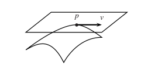

The Tangent Space
=================
> A basic principle in manifold theory is the linearization principle, according to
which a manifold can be approximated near a point by its tangent space at the point,
and a smooth map can be approximated by the differential of the map[^lu]

> The collection of tangent spaces to a manifold can be given the structure of a
vector bundle; it is then called the tangent bundle of the manifold. Intuitively, a
vector bundle over a manifold is a locally trivial family of vector spaces parametrized by points of the manifold.[^lu]

Chain Rule of Composed Functions on $\mathbb{R}^m$
--------------------------------------------------
Consider the maps $f\colon \mathbb{R}^m\rightarrow\mathbb{R}^n$, and $g\colon \mathbb{R}^n\rightarrow\mathbb{R}^l$ such that $\comp{g}{f}\colon\mathbb{R}^m\rightarrow\mathbb{R}^l$. Let us define the points in each space in terms of the components $x^a$ on $\mathbb{R}^m$, $y^b$ on $\mathbb{R}^n$, and $z^c$ on $\mathbb{R}^l$.
The chain rule for function composition is then given by
$$
\begin{aligned}
\pdv{}{x^a}(\comp{g}{f})^c=\sum_b \pdv{f^b}{x^a}\pdv{g^c}{y^b}\,,
\end{aligned}
$$
which is abbreviated to 
$$
\pdv{}{x^a} = \sum_b\pdv{y^b}{x^a}\pdv{}{y^b}\,.
$$
Note that when $m=n$, $\pdv{y^b}{x^a}$ are elements of the [Jacobian matrix](../integration-by-substitution.md#Multiple-Variables) of $\comp{g}{f}$. 
<!-- TODO why does the NONZERO Jacobian make g(f(x)) invertible? -->

Tangent Vectors in $\mathbb{R}^n$
---------------------------------
At a given point $\vb{p}$ on a surface in $\mathbb{R}^n$, there exists a vector space formed of the tangent vectors at $\vb{p}$. 

In order to generalise this space to abstract manifolds (those not embedded in a (Euclidean) space), one can use the notion of the directional derivative which isomorphic to the geometric tangent space defined above. It can then be shown that these derivations generalise to abstract manifolds.

$\gdef\TpRn{T_\vb{p}(\mathbb{R}^n)}$

Let us define the [set](../set.md) of curves $\set{\vb{v}_i}$ at a point $\vb{p}$ as the tangent space $\TpRn$ of $\vb{p}$. The *directional derivative* is defined for some $f\colon \mathbb{R}^n\rightarrow\mathbb{R}$ in $C^\infty_\vb{p}$ on this space as
$$
\begin{aligned}
D_\vb{v}f 
&= \lim_{t\rightarrow 0}\frac{f(\vb{p}+t\vb{v})-f(\vb{p}))}{t}\\
&= \dv{f(\vb{c}(t))}{t}\Big|_{t=0}\,,
\end{aligned}
$$
where $\vb{c}(t) = \vb{p} + t\vb{v}$. From the chain rule, we have
<!-- TODO: A little liberal switching from total to partials here. Justify -->
$$
\begin{aligned}
D_\vb{v}f 
&= \sum_i\pdv{c^i}{t}\bigg|_{0}\pdv{f}{x^i}\bigg|_{p}\\
&= v^i\pdv{f}{x_i}\bigg|_{p}\,,
\end{aligned}
$$
where we have dropped the explicit sum as it is implied by the index notation (over $i$). It follows that we can write $D_\vb{v}$ as
$$
D_\vb{v} = v^i\pdv{}{x_i}\,,
$$
where we have also dropped the subscript $\vb{p}$.
It can be seen that $D_\vb{v}$ form a [vector space](vector-space.md):
$$
\begin{aligned}
D_\vb{u} + D_\vb{v} &= \sum_i (u^i+v^i)\pdv{f}{x^i} = D_{\vb{u}+\vb{v}}\\
aD_\vb{u} &= \sum_i a(u^i)\pdv{f}{x^i} = D_{a\vb{u}}\,,
\end{aligned}
$$
with the axioms of distributivity and identity left implied. The basis vectors of this space are 
$$
\vb{e}_i = \pdv{}{x^i}\,.
$$
It follows that we have a vector space of functionals $\set{D_\vb{v}}$ that is *isomorphic* to the geometrical space of tangent vectors $T_p(\mathbb{R}^n)$.

Derivations at a Point
----------------------
$\gdef\DpRn{\mathcal{D}_\vb{p}(\mathbb{R}^n)}$
Any linear map $D\colon C_\vb{p}^\infty\rightarrow \mathbb{R}$ which satisfies the Leibniz rule
$$
D(fg) = (Df)g(\vb{p}) + f(\vb{p})(Dg)
$$
is called a *derivation at $\vb{p}$*, or equally a *point derivation of $C^\infty$*. Let us define the set of all derivations $D$ at $\vb{p}$ as $\DpRn$. Evidently, $D_\vb{v} \in \DpRn$, as the partial derivatives satisfy the Liebniz rule.

We can define a map $\Omega\colon \TpRn\rightarrow\DpRn$ from the geometric tangent space to the derivation space
$$
\Omega(\vb{v})\colon \vb{v}\mapsto D_\vb{v}\,,
$$
which is clearly linear, as $D_\vb{v}$ is linear in $\vb{v}$. At this point, it is not yet determined whether *every* derivation at $\vb{p}$ is a directional derivative.

## The Tangent Space at a Point
[Germ](https://en.wikipedia.org/wiki/Germ_(mathematics))
 ~ An [equivalence class](../equivalence-class.md) of an object on a topological space and others of the same kind which captures their shared local properties.

$\gdef\cpm{C^\infty_\vb{p}(M)}$

We define a *germ* of a $C^\infty$ function at $\vb{p}\in M$ to be an equivalence class of $C^\infty$ functions defined in a neighbourhood of $\vb{p}\in M$, where two functions are equivalent *if they agree on some possibly smaller neighbourhood of $\vb{p}$*. The set of germs of $C^\infty$ real-valued functions at $\vb{p}\in M$ (i.e. the [*quotient set*](../equivalence-class.md) of $C^\infty$ functions at $\vb{p}\in M$) is denoted by $\cpm$. The addition and multiplication of functions make $\cpm$ a [ring](../ring.md). With scalar multiplication by $x\in\mathbb{R}$, it [becomes an algebra](https://en.wikipedia.org/wiki/Associative_algebra#Definition).

We may define a *derivation at a point* in the manifold $M$, a *point-derivation*, of some function $f\in \cpm$ to be a linear map $D\colon \cpm\rightarrow \mathbb{R}$ such that
$$
D(fg) = (Df)g(\vb{p}) + f(\vb{p})Dg\,.
$$
The set of all derivations of $\cpm$ is a vector space called the *tangent space* at $\vb{p}$, denoted by $T_\vb{p}M$.
<!-- 
Lee notes:
p.61 - 72 tangent vectors on abstract spaces
Relate tangent vectors ON MANIFOLD to those on tangent space using pushforward function $F^*$
-->

<!-- Diff geo:
p. 86-93 tangent vectors also on abstract(?)
-->

[^lee]: J.M.. Lee, Introduction to Smooth Manifolds.
[^lu]: L.W. Tu, An Introduction to Manifolds.