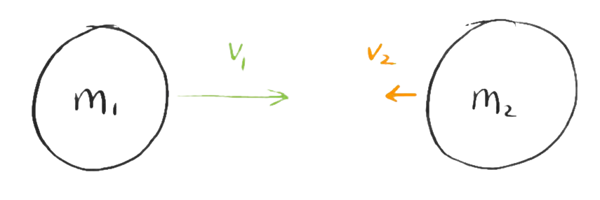
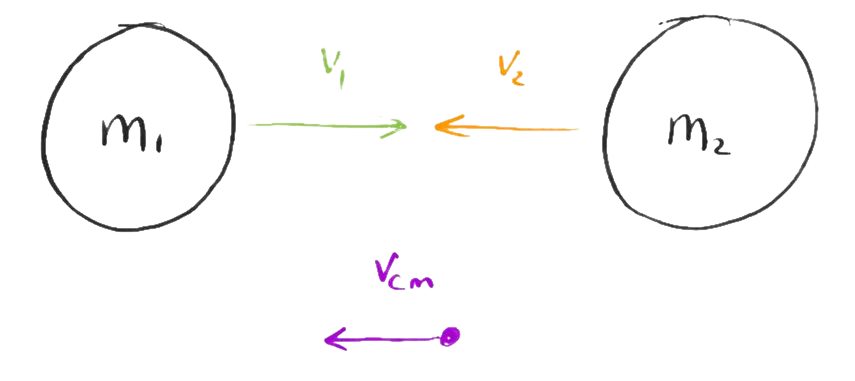

2D Collisions
=============
Consider two masses $m_1$ and $m_2$ with velocities $\vec{v_1}$ and $\vec{v_2}$ respectively.

We can create an inertial frame in which the _net_ momentum is zero, the center of momentum (CoM) frame. The velocity of this frame is given by 
$$
\vec{V_\text{cm}} = \frac{\sum_i{m_i \vec{v_i}}}{\sum_im_i}\,.
$$

In this frame, the new velocities $\mu_i$ are given by 
$$
\tag{a}
\vec{\mu_i}=\vec{v_i}-\vec{V_\text{cm}}\,.
$$

Given that the sum of momenta must be zero, 
$$
    \tag{b}
    m_1\vec{\mu_1} + m_2\vec{\mu_2} = \vec{0}\,.
$$
It also follows that, for an elastic collision,
$$
    \tag{c}
    m_1{\mu_1}^2 + m_2{\mu_2}^2 = m_1{\hat{\mu}_1}^2 + m_2{\hat{\mu}_2}^2\,,
$$

where $\vec{\hat{\mu_i}}$ is the velocity of a mass _after_ collision, in the CoM frame.

From **(b)**, we can find $\vec{\mu_2}$ and $\vec{\hat{\mu}_2}$ in terms of the velocities of $m_1$
$$
\begin{aligned}
\vec{\mu_2} &= -\frac{m_1}{m_2}\vec{\mu_1}\\
\vec{\hat{\mu}_2} &= -\frac{m_1}{m_2}\vec{\hat{\mu}_1}\,.
\end{aligned}
$$

Substituting these relations into **(c)**, it follows that
$$
\begin{aligned}
m_1{\mu_1}^2 + m_2\left(\frac{m_1}{m_2}{\mu_1}\right)^2 &= m_1{\hat{\mu}_1}^2 + m_2\left(\frac{m_1}{m_2}{\hat{\mu}_1}\right)^2\\
m_1{\mu_1}^2\left(1+\frac{m_1}{m_2}\right) &= m_1{\hat{\mu}_1}^2\left(1+\frac{m_1}{m_2}\right)\,,
\end{aligned}
$$

i.e. the energies in the CoM frame are invariant. As a CoM frame, it holds that $\sum_i m_i\vec{\hat{\mu}_i} = \vec{0}$, and so the velocities $\vec{\hat{\mu}_i}$ remain _anti-aligned_. If we assume _isotropic scattering_ in the CoM frame, then $\vec{\hat{\mu}_i}$ are rotated about _some_ axis by angle $\theta$, with respect to their original directions $\vec{{\mu}_i}$. This rotation may be represented as an orthogonal matrix $R(\theta)$, which _preserves the vector norm_, with
<!-- TODO: link to Orthogonal matrix properties -->
$$
\vec{\hat{\mu}_i} = R(\theta)\vec{\hat{\mu}}\,.
$$

The final velocities _in the lab frame_ are then simply
$$
\tag{d}
\begin{aligned}
\vec{\hat{v}_i} &= \vec{\hat{\mu}_i} + \vec{V_\text{cm}}\\
&= R(\theta)\vec{\mu_i} + \vec{V_\text{cm}}\,.
\end{aligned}
$$

If $\vec{v_2}=0$, then **(d)** reduces to 
$$
\begin{aligned}
\vec{\hat{v}_i} &= R(\theta)\vec{\mu_i} + \frac{m_1}{m_1+m_2}\vec{v_1}\,.
\end{aligned}
$$

From **(a)**, $\vec{\mu_1}=\vec{v_1}\left(1-\frac{m_1}{m_1+m_2}\right) = \vec{v_1}\frac{m_2}{m_1+m_2}$, which gives
$$
\begin{aligned}
\vec{\hat{v}_i} &= \left(R(\theta)\frac{m_2}{m_1+m_2} + \frac{m_1}{m_1+m_2}\right)\vec{v_1}\,.
\end{aligned}
$$

Energy Transfer
---------------
The ratio of the kinetic energy before and after the collision is then given by 
$$
\begin{aligned}
\frac{\hat{E}}{E} = \frac{\vec{\hat{v}_i}\cdot\vec{\hat{v}_i}}{\vec{v_1} \cdot \vec{v_1}} 
&= \left(\frac{R(\theta)m_2 + m_1}{m_1+m_2}\right)\vec{v_1}\cdot \left(\frac{R(\theta)m_2 + m_1}{m_1+m_2}\right)\vec{v_1}\\
&= \frac{{m_1}^2 + \left(R(\theta)\vec{v_1}\right)\cdot \left(R(\theta)\vec{v_1}\right){m_2}^2 + 2m_1m_2\left(R(\theta)\vec{v_1}\right)\cdot{v_1}}{\left(m_1+m_2\right)^2\lvert \vec{v_1}\rvert^2}\\
&= \frac{{m_1}^2+{m_2}^2+2m_1m_2\cos(\theta)}{\left(m_1+m_2\right)^2}\,.
\end{aligned}
$$

The _maximum_ energy loss $\Delta E$ occurs at $180\degree$ (full back scattering)
$$
\begin{aligned}
\Delta E = E - \hat{E}_\text{min} 
&= E\left(1 - \frac{\hat{E}_\text{min}}{E}\right)\\
&= E\left(1-\frac{{m_1}^2+{m_2}^2-2m_1m_2}{\left(m_1+m_2\right)^2}\right)\\
&= E\frac{4m_1m_2}{\left(m_1+m_2\right)^2}\,.
\end{aligned}
$$

If $m_1\gg m_2$, then
$$
\begin{aligned}
\Delta E 
&=  E\frac{4m_1m_2}{\left(m_1+m_2\right)^2}\\
&= E\frac{4m_1m_2}{{m_1}^2\left(1+\frac{m_2}{m_1}\right)^2}\\
&\approx E\frac{4m_2}{{m_1}}\,.
\end{aligned}
$$

Deflection Angle
----------------
The deflection angle $\phi$ in the lab frame can be determined from the dot product of the initial and final velocities:
$$
\begin{aligned}
\lvert\vec{v_1}\rvert^2\cos(\phi) &= \vec{\hat{v}_1}\cdot\vec{v_1}\\
&= \frac{m_2 \left(R(\theta)\vec{v_1}\right)+m_1\vec{v_1}}{m_1+m_2}\cdot\vec{v_1}\\
&= \lvert \vec{v_1}\rvert^2\left(\frac{m_1+m_2\cos(\theta)}{m_1+m_2}\right)\\
\cos(\phi) &= \frac{m_1+m_2\cos(\theta)}{m_1+m_2}\,.
\end{aligned}
$$
As considered above, in the limit $m_1\gg m_2$, $\cos(\phi)\rightarrow 1$. Thus, when the incident mass is much greater than the target, the deflection angle $\phi$ approaches zero.