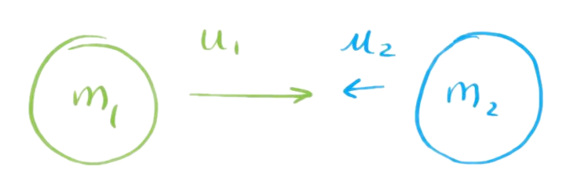
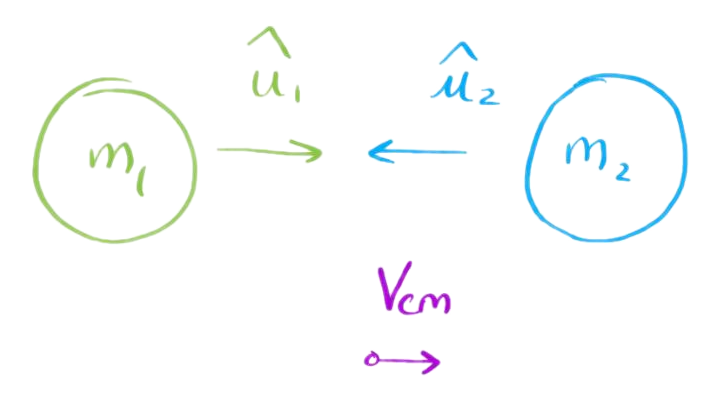

2D Non-Relativistic Collisions
==============================

Consider two masses $m_1$ and $m_2$ with velocities $\vb{u_1}$ and $\vb{u_2}$ respectively.

<!--  -->

```bob
                   .---.
                   |Lab|
                   '---'
     _____                       _____
   ,'     `.                   ,'     `.
  /         \     u1      u2  /         \
 (    m1     ) --------> <-- (    m2     )
  \         /                 \         /
   `._____,'                   `._____,'

```

We can create an inertial frame in which the _net_ momentum is zero, the center of momentum (CoM) frame. The velocity of this frame is given by

$$
\vb{V_\text{cm}} = \frac{\sum_i{m_i \vb{u_i}}}{\sum_im_i}\,.
$$

In this frame, the new velocities $\hat{u}_i$ are given by

$$
\tag{a}
\vb{\hat{u}_i}=\vb{u_i}-\vb{V_\text{cm}}\,.
$$

<!--  -->

```bob
                   .----.
                   |CoM |
                   '----'
     _____                       _____
   ,'     `.      ^     ^      ,'     `.
  /         \     u1    u2    /         \
 (    m1     ) -----> <----- (    m2     )
  \         /                 \         /
   `._____,'                   `._____,'

                     ---> Vcm

```

Given that the sum of momenta must be zero,

$$
    \tag{b}
    m_1\vb{\hat{u}_1} + m_2\vb{\hat{u}_2} = \vb{0}\,.
$$

It also follows that, for an elastic collision,

$$
    \tag{c}
    m_1{\hat{u}_1}^2 + m_2{\hat{u}_2}^2 = m_1{\hat{v}_1}^2 + m_2{\hat{v}_2}^2\,,
$$

where $\vb{\hat{\hat{u}_i}}$ is the velocity of a mass _after_ collision, in the CoM frame.

From **(b)**, we can find $\vb{\hat{u}_2}$ and $\vb{\hat{v}_2}$ in terms of the velocities of $m_1$

$$
\begin{aligned}
\vb{\hat{u}_2} &= -\frac{m_1}{m_2}\vb{\hat{u}_1}\\
\vb{\hat{v}_2} &= -\frac{m_1}{m_2}\vb{\hat{v}_1}\,.
\end{aligned}
$$

Substituting these relations into **(c\)**, it follows that

$$
\begin{aligned}
m_1{\hat{u}_1}^2 + m_2\left(\frac{m_1}{m_2}{\hat{u}_1}\right)^2 &= m_1{\hat{v}_1}^2 + m_2\left(\frac{m_1}{m_2}{\hat{v}_1}\right)^2\\
m_1{\hat{u}_1}^2\left(1+\frac{m_1}{m_2}\right) &= m_1{\hat{v}_1}^2\left(1+\frac{m_1}{m_2}\right)\,,
\end{aligned}
$$

i.e. the energies in the CoM frame are invariant. As a CoM frame, it holds that $\sum_i m_i\vb{\hat{v}_i} = \vb{0}$, and so the velocities $\vb{\hat{v}_i}$ remain _anti-aligned_. If we assume _isotropic scattering_ in the CoM frame, then $\vb{\hat{v}_i}$ are rotated about _some_ axis by angle $\theta$, with respect to their original directions $\vb{{\hat{u}}_i}$. This rotation may be represented as an [orthogonal matrix](../maths/linear-algebra/square-matrices.md) $R(\theta)$, which _preserves the vector norm_,

<!-- TODO: link to Orthogonal matrix properties -->

$$
\vb{\hat{v}_i} = R(\theta)\vb{\hat{u}_i}\,.
$$

The final velocities _in the lab frame_ are then simply

$$
\tag{d}
\begin{aligned}
\vb{v_i} &= \vb{\hat{v}_i} + \vb{V_\text{cm}}\\
&= R(\theta)\vb{\hat{u}_i} + \vb{V_\text{cm}}\,.
\end{aligned}
$$

If $\vb{u_2}=0$, then **(d)** reduces to

$$
\begin{aligned}
\vb{v_i} &= R(\theta)\vb{\hat{u}_i} + \frac{m_1}{m_1+m_2}\vb{u_1}\,.
\end{aligned}
$$

Consider $\vb{v_1}$. From **(a)** we have $\vb{\hat{u}_1} = \vb{u_1}\frac{m_2}{m_1+m_2}$, which gives

$$
\begin{aligned}
\vb{v_1} &= \left(R(\theta)\frac{m_2}{m_1+m_2} + \frac{m_1}{m_1+m_2}\right)\vb{u_1}\,.
\end{aligned}
$$

## Energy Transfer

The ratio of the kinetic energy before and after the collision is then given by

$$
\begin{aligned}
\tag{e}
\frac{E(\theta)}{E_0} = \frac{\vb{v_i}\cdot\vb{v_i}}{\vb{u_i} \cdot \vb{u_i}}
&= \left(\frac{R(\theta)m_2 + m_1}{m_1+m_2}\right)\vb{u_i}\cdot \left(\frac{R(\theta)m_2 + m_1}{m_1+m_2}\right)\vb{u_i}\\
&= \frac{{m_1}^2\abs{\vb{u_i}}^2 + \left(R(\theta)\vb{u_i}\right)\cdot \left(R(\theta)\vb{u_i}\right){m_2}^2 + 2m_1m_2\left(R(\theta)\vb{u_i}\right)\cdot{u_i}}{\left(m_1+m_2\right)^2\lvert \vb{u_i}\rvert^2}\\
&= \frac{{m_1}^2+{m_2}^2+2m_1m_2\cos(\theta)}{\left(m_1+m_2\right)^2}\,.
\end{aligned}
$$

The _maximum_ energy loss $\Delta E$ occurs at $180\degree$ (full back scattering)

$$
\begin{aligned}
\Delta E = E_0 - E(\theta)_\text{min}
&= E_0\left(1 - \frac{E(\theta)_\text{min}}{E_0}\right)\\
&= E_0\left(1-\frac{{m_1}^2+{m_2}^2-2m_1m_2}{\left(m_1+m_2\right)^2}\right)\\
&= E_0\frac{4m_1m_2}{\left(m_1+m_2\right)^2}\,.
\end{aligned}
$$

If $m_1\gg m_2$, then

$$
\begin{aligned}
\Delta E
&= E_0\frac{4m_1m_2}{{m_1}^2\left(1+\frac{m_2}{m_1}\right)^2}\\
&\approx E_0\frac{4m_2}{{m_1}}\,.
\end{aligned}
$$

## Deflection Angle

The deflection angle $\phi$ in the lab frame can be determined from the dot product of the initial and final velocities

$$
\begin{aligned}
\cos(\phi) &= \frac{\vb{v_1}\cdot\vb{u_1}}{\abs{\vb{u_1}}\abs{\vb{v_1}}}\\
&= \frac{1}{\abs{\vb{u_1}}\abs{\vb{v_1}}}\frac{m_2 \left(R(\theta)\vb{u_1}\right)+m_1\vb{u_1}}{m_1+m_2}\cdot\vb{u_1}\\
&= \frac{\abs{ \vb{u_1}}}{\abs{ \vb{v_1}}}\left(\frac{m_2\cos(\theta)+m_1}{m_1+m_2}\right)\,.
\end{aligned}
$$
The ratio $\frac{\abs{ \vb{u_1}}}{\abs{ \vb{v_1}}}$ is given by **(e)**, leading to
$$
\cos(\phi) = \frac{m_2\cos(\theta)+m_1}{\sqrt{m_1^2+m_2^2+2m_1m_2\cos(\theta)}}\,.
$$

As considered above, in the limit $m_1\gg m_2$, $\cos(\phi)\rightarrow 1$. Thus, when the incident mass is much greater than the target, the deflection angle $\phi$ approaches zero.
