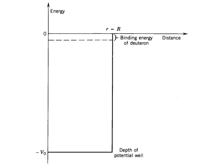

# The Deuteron

A deuteron $\atom{2}{H}$ is the simplest bound state of nucleons, consisting of a proton and neutron. A neutral atom of $\atom{2}{H}$ is called _deuterium_. As a weakly bound system, it has no excited states; the only excited states are unbound systems (that of a free proton and neutron).

## Binding Energy

The [binding energy](binding-energy.md#Binding-Energy) of the deuteron is precisely known, using techniques such as [the mass doublet method](binding-energy.md#Mass-Doublet-Method), which gives[^krane.81]

$$
\tag{1}
m(\text{C}_6\text{H}_{12})- m(\text{C}_6\text{D}_{6}) = (9.289710 \pm 0.000024)\times 10^{-3}\unit{\amu}\,.
$$

From **(1)**, it follows that $m(\atom{2}{D}) = 2.014101789 \pm 0.000000021\unit{\amu}$. The binding energy is then 
$$
B = \left[m(\atom{1}{H}) + m(n)-m(\atom{2}{H})\right]c^2 = 2.22463\pm 0.0004 \unit{\MeV}\,.
$$
One can also determine the binding energy by bringing together an unbound proton and neutron together to form $\atom{2}{H}$, and measuring the energy of the photon emitted (plus a recoil correction):
$$
    \atom{1}{H} + n \rightarrow \atom{2}{H} + \gamma\,.
$$
This reaction can be performed in reverse; determining the minimum photon energy required to produce deuterium (less the recoil energy).

Given that the average binding energy per nucleon [is about $8\unit{\MeV}$](binding-energy.md#Binding-Energy), it follows that the deuteron is very weakly bound in comparison to typical nuclei.
<!--
TODO only if we write up spherical potential to justify \psi=u(r)/r
We might model the nucleon-nucleon potential of the deuteron as a simple three-dimensional square well:

expressed in equation form as
$$
V(r) = \begin{cases}
-V_0, & r \leq R\\
0, & r > R\\
\end{cases}\,.
$$
Given that $r$ represents the separation of the neutrons, $R$ is effectively a measure of the diameter of the deuteron.

Also vaguely relevant - https://ocw.mit.edu/courses/nuclear-engineering/22-02-introduction-to-applied-nuclear-physics-spring-2012/lecture-notes/MIT22_02S12_lec_ch5.pdf
-->

Spin
----
$\gdef\S{\hat{S}}$
The total angular momentum $I$ of the deuteron is given by the sum of the angular momenta of the nucleons, which add according to a set of [addition rules](../../quantum-mechanics/angular-momentum-addition.md). 
$$
\vb{\hat{I}} = \vb{\hat{L}}_1 + \vb{\S}_1 + \vb{\hat{L}}_1 + \vb{\S}_1\,.
$$
It is conventional to consider the addition of the orbital angular momentum of the entire system and the individual spins:
$$
\tag{2}
\vb{\hat{I}} = \vb{\hat{L}} + \vb{\S}_1 + \vb{\S}_1\,,
$$
though one could also express $I$ in terms of the total orbital and spin operators
$$
\vb{\hat{I}} = \vb{\hat{L}} + \vb{\S}\,.
$$
From [addition of the two spins](../../quantum-mechanics/two-particle-spin-half-states.md), the total spin $S$ has a singlet state $\ket{s=0;m_s=0}$ and a triplet state $\ket{s=1;m_s=\pm 1,0}$.
In nature, the deuteron is observed to have $I=1$. We may determine which states couple to produce $I=1$, given that $S\in\set{0,\,1}$ and $L\geq 0$:

| $l$ 	| $s$ 	| $\set{I}$         	|
|:---:	|:---:	|-------------------	|
|  0  	|  0  	| $\set{0}$         	|
|  0  	|  1  	| $\set{\mathbf{1}}$         	|
|  1  	|  0  	| $\set{\mathbf{1}}$         	|
| 1   	| 1   	| $\set{0,\,\mathbf{1},\,2}$ 	|
| 2   	| 0   	| $\set{2}$         	|
| 2   	| 1   	| $\set{\mathbf{1},\,2}$     	|

It can be seen that there are four ways to couple $L$ and $S$ to produce $I=1$.

NB Because an $s=0$ state is not observed (as the Deuteron is $J^\pi=1^+$), it follows that the nuclear force must be spin dependent to forbid the singlet state.[^krane.100]

Parity
------
To determine which of these states the deuteron can occupy, it suffices to look at the parity of the _ground state_ deuteron wavefunction, which is found experimentally to be even. If the wavefunction is given by
$$
\psi(\vb{x}') = \braket{\vb{x}'}{\xi}\,,
$$
then to be even under parity it follows that
$\gdef\parity{\hat{\pi}}$
$$
\tag{3}
\begin{aligned}
\psi(-\vb{x}') 
&= \bra{\vb{x}'}\parity\ket{\xi}\\
&= \braket{-\vb{x}'}{\xi}\,.
\end{aligned}
$$
<!-- TODO discuss true w.f. is (<r|⊗<S|) |a>, so we have spin w.f. <S|a_S> and position w.f. <r|a_r>
-->
For **(3)** to hold, the state ket $\ket{\xi}$ must be an eigenket of $\parity$ (to have definite parity) with an eigenvalue of $+1$. We can express a state ket as
$$
\ket{\xi} = \ket{\xi_\vb{r}}\otimes\ket{\xi_\vb{S}}\,.
$$
<!-- TODO: is this definition of parity (i.e. only acts on position space) valid? : http://www.pas.rochester.edu/~passage/resources/prelim/Quantum/UCB%20Notes/19%20parity.pdf -->
<a style="color:red">TODO this isn't correct - parity is defined for spin ang-mom space. Add notes on even/odd-ness under parity transformation (pi^dagger X pi = f(X)<a>
NB the parity of the wavefunction depends solely upon the position ket, as
$$
\parity = \parity_\vb{r}\otimes1_\vb{S}\,,
$$
hence the inner product $\bra{\vb{x}}\parity\ket{\xi}$ depends upon the spin state:
$$
\begin{aligned}
\bra{\vb{x}}\parity\ket{\xi}
&= \left(\bra{\vb{x}}\otimes 1\right)\left[\parity_\vb{r}\otimes1_\vb{S}\right]\left(\ket{\xi_\vb{r}}\otimes\ket{\xi_S}\right)\\
&= \bra{\vb{x}}\parity_\vb{r}\ket{\xi_\vb{r}}\otimes\ket{\xi_\vb{S}}\\
&= \psi_\xi(-\vb{x})\ket{\xi_\vb{S}}\,.
\end{aligned}
$$
We can represent the position ket in the [eigenbasis of the orbital angular momentum operators](../../quantum-mechanics/orbital-angular-momentum.md) $\L_z$ and $\L^2$:
$$
\ket{\xi_\vb{r}} = \sum_l\sum_{m_l}^{2l+1}\sum_k^{N(l)} \ket{k,l,m_l}\overline{R_{l,k}(r')Y_l^{m_l}\mleftright{(}{\theta',\phi'}{)}}\,.
$$
An orbital angular momentum wavefunction has a parity defined by 
$$
\pi \ket{k,l, m_l}=(-1)^{l} \ket{k,l,m_l}\,,
$$
which follows from the fact that behaviour of the spherical harmonics under parity
$$
\begin{aligned}
\bra{\vb{x}'}\hat\pi\ket{k,l,m_l} 
&= \braket{-\vb{x}'}{k,l,m_l}\\
&= (-1)^l\braket{\vb{x}'}{k,l,m_l}\\
&= \bra{\vb{x}'}(-1)^l\ket{k,l,m_l}\,.
\end{aligned}
$$
NB is clear that $R_{l,k}$ is invariant under parity, as $r$ is unchanged.
Hence in the angular momentum basis we have
$$
\begin{aligned}
\bra{\vb{x}'}\parity\ket{\xi_\vb{r}} 
&= \sum_l\sum_{m_l}^{2l+1}\sum_k^{N(l)} \bra{\vb{x}'}\parity\ket{k,l,m_l}\overline{R_{l,k}(r')Y_l^{m_l}\mleftright{(}{\theta',\phi'}{)}}\\
&= \sum_l\sum_{m_l}^{2l+1}\sum_k^{N(l)} (-1)^{l} \braket{\vb{x}'}{k,l,m_l}\overline{R_{l,k}(r')Y_l^{m_l}\mleftright{(}{\theta',\phi'}{)}}\,.
\end{aligned}
$$
As $\ket{\xi_\vb{r}}$ is a sum of states with distinct parities (according to $l$), it follows that for $\psi(\vb{x}')=\psi(-\vb{x}')$ only the even parity contributions to the expansion in $\ket{k,l,m_l}$ are permitted, i.e.
$$
l \in 2\mathbb{N}\,.
$$

This leaves only the $l=0$ and $l=2$ states from the above table. 

    
Note that for $l=0$, the maximal projection $m_j=1$ of $\ket{\xi}$ has $m_s=1$ (from $m_l=0$). We know from the addition of angular momenta that in this "top" state, the spins of each particle *must be aligned*: $m_s^{(1)}=m_s^{(2)}=+\frac{1}{2}$.

Magnetic Dipole Moment
----------------------
It [was observed](electromagnetic-moments.md) that there are both spin and orbital angular momentum contributions to the magnetic *dipole* moment of the nucleus, according to the values of $l$ and $s$. With $l=0$, there will be solely a spin contribution
$$
\def\mom{\vb{\mu}}
\begin{aligned}
\mom 
&= \mom_n + \mom_p\\
&= \frac{g_\text{sn}\mom_N}{\hbar}\vb{s}_n + \frac{g_\text{sp}\mom_N}{\hbar}\vb{s}_p\\
\end{aligned}
$$
Taking the observed magnetic moment to be that when the spin $z$ projections $m_j\hbar$ have their maximum projection, it follows that
$$
\begin{aligned}
\mu 
&= \frac{1}{2}\mu_N\left(g_\text{sn}+g_\text{sp}\right)\\
&= 0.879804\operatorname{\mu_N}\,.
\end{aligned}
$$
Experimentally, the observed value in the ground state is $\mu=0.7574376 \pm 4\times 10^{-7}\operatorname{\mu_N}$, which does not agree with this calculation. Though this discrepancy can be attributed to several factors including contributions from the charged virtual mesons exchanged between the nucleons, it can be assumed that a contribution to $\mu$ from the *orbital angular momentum* is its primary origin.[^wong.62] Let the deuteron have its ground state ket defined by
$$
\ket{\xi} = \Big(\alpha\ket{l=0} + \beta\ket{l=2}\Big)\otimes\ket{s=1}\,.
$$
With a maximal projection, $m_j=j$, and so it follows that $m_s+m_l=1$, which permute as follows:
| $m_s$ 	| $m_l$ 	| Spins                                   	|
|-------	|-------	|-----------------------------------------	|
| $0$   	| $1$   	| $\alpha\uparrow\downarrow+\beta\downarrow\uparrow$ 	|
| $1$   	| $0$   	| $\uparrow\uparrow$                      	|
| $-1$  	| $2$   	| $\downarrow\downarrow$                  	|

<!-- TODO analysis of this mixture must come from form of dipole moment of nucleus. 
https://en.wikipedia.org/wiki/Nuclear_magnetic_moment
Samuel Wong: p.6
-->
<!-- TODO discuss the fact that l=0 predicts vanishing quadrupole moment (see electromagnetic-moments.md), yet we observe nonzero positive Q=0.00288 \pm 0.00002\barn which implies l=0 + l=2. Therefore the deuteron is non-spherical. This means that the n-p potential is non central-is a tensor. dV/d0 =/= 0, so there is a force -> torque -> L not conserved
-->
<!-- TODO 
The
orbital angular momentum is, therefore, not a good quantum number and the nucleon-
nucleon interaction potential does not, commute with the operator L^2 [(why?)]:
...
The fact that the deuteron ground state is a linear combination of these two
basis states implies that the off-diagonal matrix elements are not zero
-->

Hamiltonian
-----------
* Energy of ground state is well defined so must be eigenstate of $H$
* If the ground state is angular momentum eigenket, then $\comm{H}{L^2}=0$, hence in the angular momentum eigenbasis, $H$ would be diagonal.

[^wong.62]: Samuel S. M. Wong, Introductory Nuclear Physics, 2. ed. ed. (Wiley, New York [u.a.], 1998), p. 64.
[^krane.81]: Kenneth S. Krane, Introductory nuclear physics, (Wiley, New York u.a, 1987), p. 81.
[^krane.100]: Kenneth S. Krane, Introductory nuclear physics, (Wiley, New York u.a, 1987), p. 100.