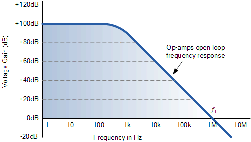
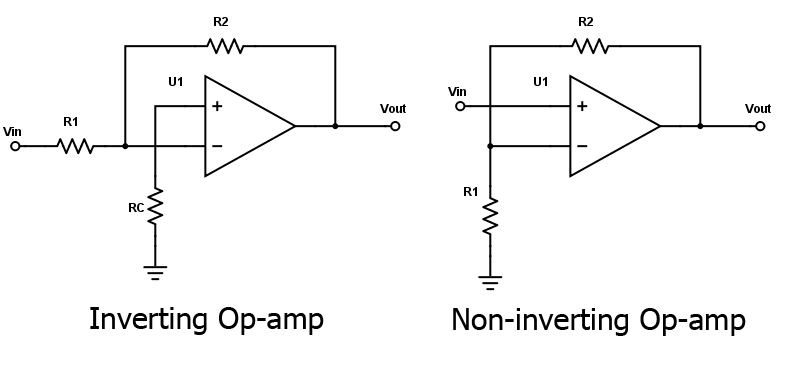

Amplifiers
==========
Most amplifiers utilise Operational Amplifiers (Op-Amps) which amplify
input signals using transistors. Such devices typically have open loop
(no feedback) gains of up to $1\times 10^5$. The gain $A$ is defines as
$$
A  =\frac{V_\text{out}}{V_\text{in}}\,.
$$

Op-Amps have an inverse gain-frequency response, which yields a decrease
in gain as frequency increases. This can be shown with a number of
linear regions using a *Bode plot*.

There are a number of requirements for an "ideal Op-Amp":

1.  Large open loop gain $\sim \infty$

2.  Infinite input resistance (draws little current)

3.  Low output resistance (output voltage unaffected by load)

4.  Perfect differential amplifier ($V_\text{out}=A(V_{+}-V_{-})$)

Real op amps will saturate at the supply voltage, and do not exhibit a
zero intercept when plotting the output voltage against the differential
input voltage.

In addition, the amplifier gain depends upon both temperature and time
(it exhibits an ageing phenomenon). In order to stabilise the gain, a
negative feedback loop should be introduced.

There are two configurations of negative feedback that are typically
used: inverting, and non-inverting.

Non Inverting
-------------
The gain in this configuration is given as
$$A_\text{non-inv}=\frac{R_1+R_2}{R_1}\,.$$

From the schematics, it can be seen that the noninverting configuration
is one of high input impedance, whilst the inverting configuration has a
low input impedance. For the use of an OpAmp as a preamplifier for a
radiation detector, it is desirable to maximise the charge collection
from the detector, and hence a low impedance configuration (inverting)
is chosen.

Inverting
---------
Given that the input resistance is infinite (in the ideal case), the current through $R_1$ and $R_2$ is constant, and hence $V_\text{out}\propto R_1+R_2$.

The gain in this configuration is given as
$$A_\text{inv}=-\frac{R_2}{R_1}\,.$$

It can be shown that the potential at the inverting input $V_-$ is given as
$$
    V_-=V_\text{in}\frac{R_2/(1+A)}{R_1+R_2/(1+A)}\,.
$$ 
For $A\rightarrow \infty$,
it follows that $V_-\rightarrow 0\operatorname{V}$, and consequently we
consider the input $V_-$ to be a "virtual earth".