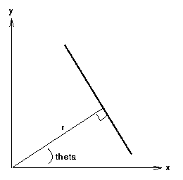

# The (Classical) Hough Transform

The _classical_ Hough transform is a feature extraction technique used to find a subset of geometrical shapes within an image subject to imperfections.

## Lines

In polar space, a line may be parametrised in _Hesse normal form_ by the length $r$ of the normal to the origin $\vec{r}$, and the angle $\theta$ of $\vec{r}$ with respect to the origin:

$$
r(\theta) = x_i\cos(\theta) + y_i\sin(\theta)\,.
$$

For any point $(x, y)$ on this line, $r$ and $\theta$ are _constant_.

In the context of image analysis, the cartesian coordinates $(x_i,y_i)$ are known, whilst $(r,\theta)$ are the parameters to be solved for. Given that for all points on a straight line, $r$ and $\theta$ remain constant, it follows that there exist many lines upon which $(x_i, y_i)$ lies, and thus each $(x_i, y_i)$ in cartesian space maps to _curves_ in the polar Hough parameter space. Hence, points which are colinear in cartesian space (i.e. lie on the same line) will map to curves in Hough space which intersect at some $(r, \theta)$.

The transform is implemented by transforming each $(x_i, y_i)$ into Hough parameter space, and then incrementing an accumulator each $(r_i, \theta_i)$ along a discretisation of the $(r,\theta)$ curve. Identifying peaks in the resulting $(r,\theta)$ histogram indicates the presence of a line with the given parameters.
