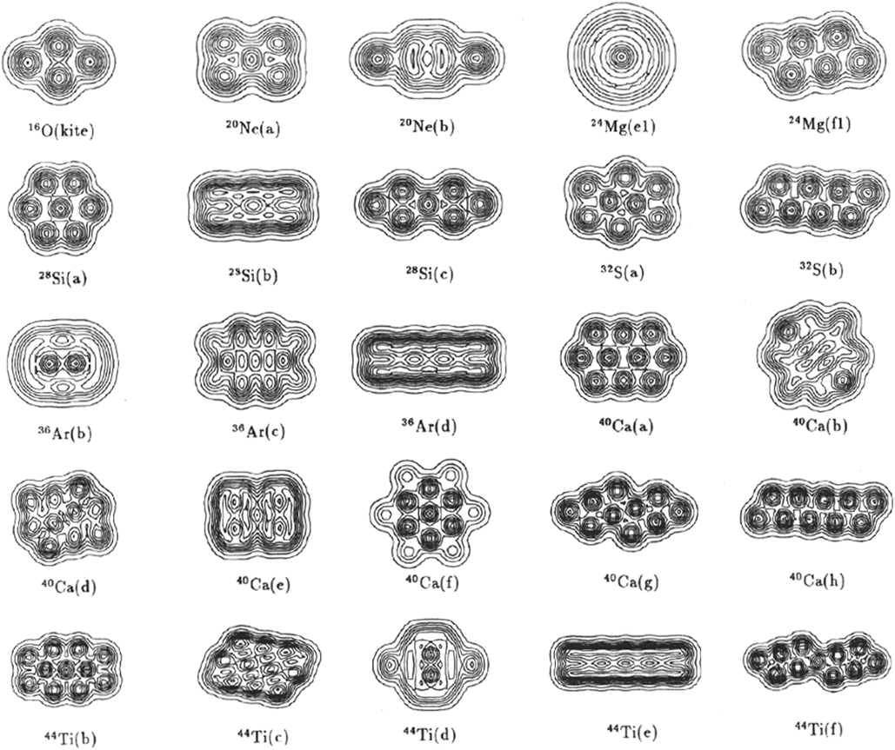
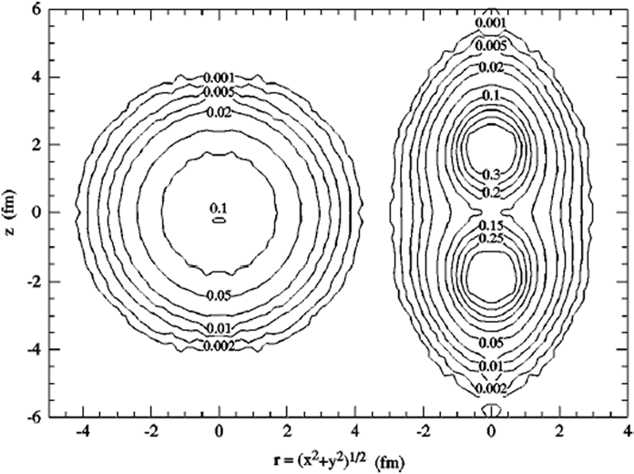
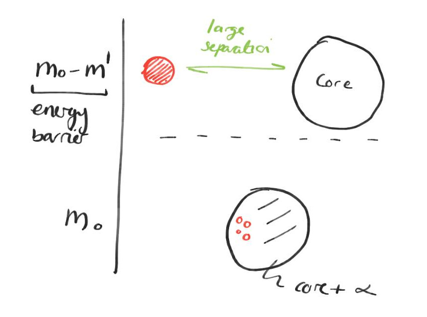
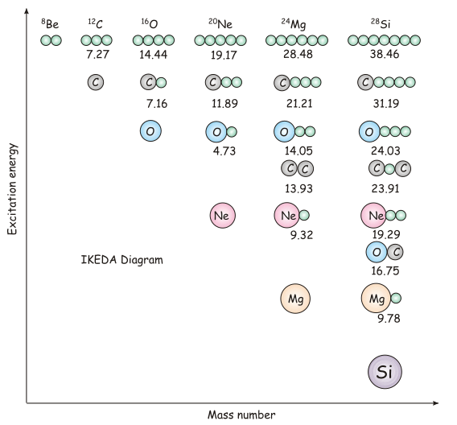

Clustering
==========
In 1988, Ikeda proposed the following definition of a cluster:
> [A] spatially localized substructure composed of strongly correlated nucleons[...] characterised by internally strong and externally weak interactions[... in which] α clustering is the most prominent.

There are several concepts of a cluster which are consistent with this definition:
* Microscopic clusters (in which _all nucleons are described_ and the Pauli antisymmetrization is performed).
* Clusters as structureless component particles.
* Clusters as emitted nuclei.

Microscopic Clusters
--------------------
Introduced by Wheeler, microscopic clusters involve a molecular picture where
> the constituent neutrons and protons are divided into various
groups (such as alpha-particles)

These groups are the nuclear clusters. Wheeler also introduced an antismmetrized wave function, based upon α clusters, known as the [_resonating-group wave function_][1]).

---

* $\alpha$ particles are more tightly bound than the average nucleus (per nucleon), so $\alpha$s can move throughout the nucleus relatively unpeturbed.
* As the nuclear density falls to $\frac{1}{3}$ nominal, $\alpha$ clusters form from condensing nucleons. Associated with this condensation is a _preformation probability_.
    

    #### Preformation Probability
      Preformation of $\alpha$ particles inside the nucleus is the first step to $\alpha$ decay. It indicates the degree of $\alpha$ clustering within the nucleus.

    $S_\alpha$ is the probability that an $\alpha$ particle will form from four nucleons on the surface of the nucleus.
    

    * Full shells maximise binding energy, so they have large associated jumps in energy levels, e.g., $^{16}\text{O}$, $^{12}\text{C}$, which are _alpha conjugate_ nuclei.
      

  
  #### $\alpha$ Conjugate Nuclei
  $\alpha$ conjugate nuclei have an equal and even number of protons and neutrons, such that they are effectively composed of $n\in Z$ $\alpha$ particles (in concept only). 
  

  Despite having considerable binding energies (implying stability within the mean field), $^{16}\text{O}$ and $^{12}\text{C}$ have relatively low energy first excited states and decay thresholds, 
  
  > which results in their limited resistance against the destabilizing influence of other dynamics within the nucleus.
  
* In general, clustering arises in order to maximise the interactions (and hence binding) between nucleons. This can be seen with ab-initio (from first principles) Alpha Cluster Models (ACM) which constrain nucleons to a 2D plane:
  
  This can also be seen with Greens function Monte Carlo (GFMC) modelling of $^8\text{Be}$, which model the nucleon-nucleon interaction in terms of all two and three body components. As such, this is not an _effective interaction_ (which ignores local degrees of freedom), hence the ground state observed in $^8\text{Be}$  (see figure) may well actually be $\alpha$-$\alpha$ clustered. 
  
  
  Both AMC and GFMC are approaches to solving ab-initio calculations of the structure of light nuclei.
* $\alpha$ conjugate nuclei show a linear trend of binding energy per nucleon vs the number of $\alpha$-$\alpha$ bonds, which might imply that $\alpha$ particle exists in the ground state, and that there exists a _constant_ $\alpha$-$\alpha$ interaction (such that a linear trend is observed). In the current understanding, it is actually beleived that the cluster structure is eroded in most ground states. From this work, however, a geometrical approach to clustering was postulated.
* Later (1960s) it was realised that the cluster structure is not manifest in the ground state, but emerges as internal energy of the nucleus increases (there is an energy _barrier_ to clustering). 
   
  Hence, when the components are brought together, a similar energy $\Delta m = m_c-m_0 - E_i$ (where $E_i$ is the _interaction energy_) is required to cluster. Similarly, as $\Delta m$ is the energy barrier to _separation_, the cluster will become unstable when the energy exceeds $\Delta m$. This establishes a small window $E_d \lt E \lt E_f$ between the decay and formation energies in which a cluster is stable. This result is summarised in the Ikeda diagram, which illustrates that each new cluster degree of freedom arises as a cluster decay threshold is approached or crossed:
   
  At higher energies, greater numbers of cluster bonds leads to a greater number of degrees of freedom.
* As well as energy driving clustering, there is also symmetries, which act to guide the formation of the clusteres themselves.

[1]: https://iopscience.iop.org/article/10.1088/1742-6596/569/1/012092/pdf
[2]: https://arxiv.org/abs/1705.06192 <!-- All images credit to original author unless otherwise stated -->