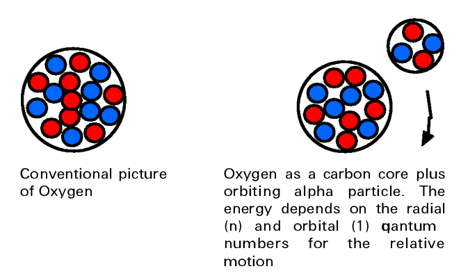
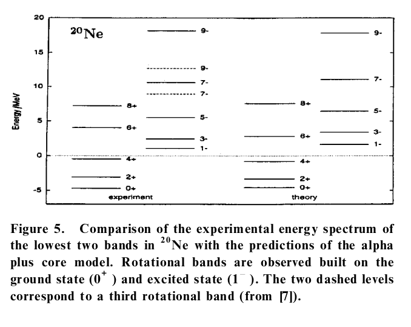
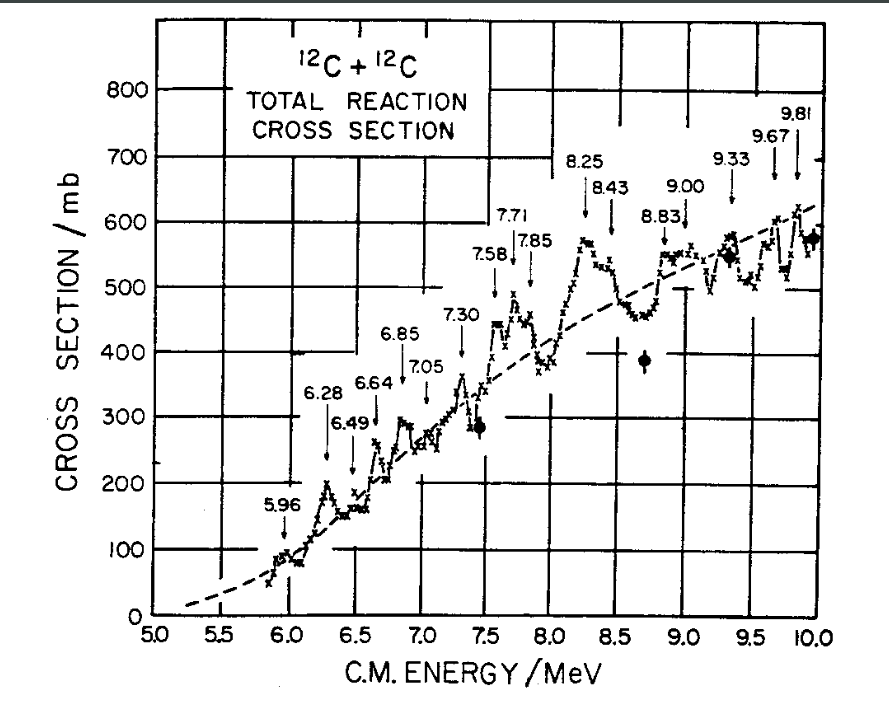
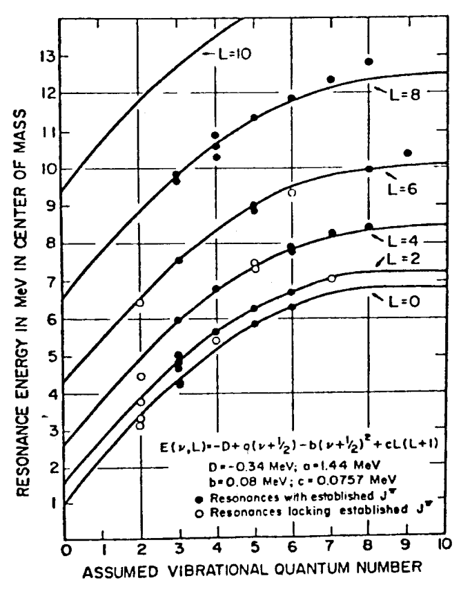
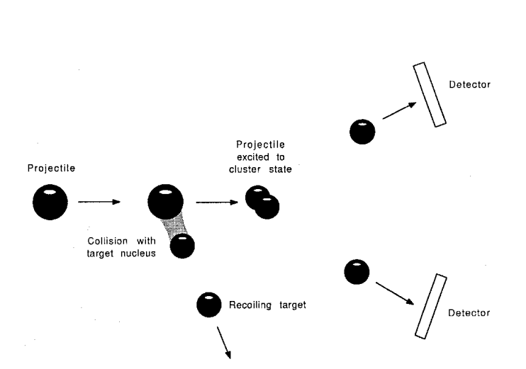
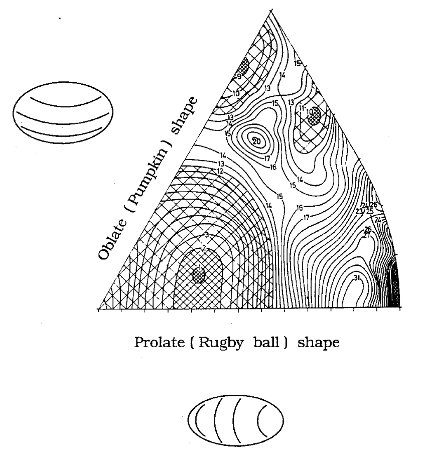

Clustering
==========

<!-- notes-->
<!--
Initially (Brink, Pauling) proposed geometric clustering configurations. Ikeda followed with 
high BE of alpha means easy formation
high first ex means remains unpeturbed[bailey]
-->
<!-- end notes -->
Early Understanding
-------------------
In the early days of nuclear physics, it was proposed that nuclei could cluster in $\alpha$-conjugate particle structures, based upon the notion of $\alpha$-preformation in $\alpha$-decay. 
  

  #### $\alpha$ Conjugate Nuclei

  $\alpha$ conjugate nuclei have an equal and even number of protons and neutrons, such that they are effectively composed of $n\in Z$ $\alpha$ particles (in concept only).

  

  
  Associated with this condensation is a _preformation probability_.

  

  #### Preformation Probability

  Preformation of $\alpha$ particles inside the nucleus is the first step to $\alpha$ decay. It indicates the degree of $\alpha$ clustering within the nucleus.

  $S_\alpha$ is the probability that an $\alpha$ particle will form from four nucleons on the surface of the nucleus.

From this revelation several geometric configurations were proposed by Brink and Pauling.

In 1988, Ikeda then proposed the following definition of a cluster:

> [A] spatially localized substructure composed of strongly correlated nucleons[...] characterised by internally strong and externally weak interactions[... in which] α clustering is the most prominent.

He suggested that a new cluster degree of freedom arises as a cluster decay threshold is approached or crossed:  

There are several concepts of a cluster which are consistent with this definition:
- Microscopic clusters (in which _all nucleons are described_ and the Pauli antisymmetrization is performed).
- Clusters as structureless component particles.
- Clusters as emitted nuclei.

$\alpha$+core structure
-----------------------
As the nuclear density falls to $\frac{1}{3}$ nominal, $\alpha$ clusters form from condensing nucleons.[^fulton.p4] This is predicted by theory, and suggests $\alpha$'s form on surface where density falls to zero over a skin-layer. This lead to the development of the $\alpha$+core model, which can be modelled by an effective two-body interaction.[^fulton.p4]  
This effective potential describes the interaction between
the $\alpha$ particle and the core as an average over
the interactions between the individual nucleons.

Solving the two-body Schrödinger equation allows for excitations of the nucleus to be modelled as higher angular momentum and principle quantum number states. Further work has been to permit the core to be excited, rather than in its ground state. Longer term, efforts to develop a uniform effective interaction which describes many $\alpha$-core nuclei are underway.
 
  

> [...] if we were to take the wave function
describing the nucleus and project out the density, it would
appear that the matter was distributed as expected for the
core and orbiting particle. Of course we can never `freeze’
the system and what we see is a time average of the particle motion, making it harder to see the cluster features.
However, to all intents and purposes the nucleus can behave as if it were comprised of the core and orbiting alpha particle and the way in which it responds to the input of energy and angular momentum reflects this picture[^fulton.p7]

<!-- TODO mention other types of cluster particles -->

Nuclear Molecules
-----------------

In the low energy scattering of light $4n$ nuclei, instead of a smooth curve, one with resonances is observed.

If these peaks are explained by the formation of intermediate states, then it follows that we can estimate their lifetimes from $\Delta E\Delta t\approx\frac{\hbar}{2}$, which yields values far exceeding the time taken for the two nuclei to pass one another. This strongly implies the creation of a "molecular state", i.e. the formation of a compound nucleus formed of the two nucleons in the beam and target. This picture resembles that of the $\alpha$+core model, but for far larger clusters. To confirm the existence of such clusters, one can characterise the energy of excited states by an excitation function based upon that of an atomic molecule, with vibrational and rotational modes. One such function is the Morse potential, 
$$\tag{1}
    E(v,L) = aL(L+1)+b\left(v+\frac{1}{2}\right)+c\left(v+\frac{1}{2}\right)^2+d\,,
$$
where $a,b,c,d$ are constants, and $L$ the rotational and $v$ the vibrational quantum numbers of the molecule. The first term characterises the rotational excitement and the second two terms the vibrational excitation of the molecule. States with known $L$ can be agree with the model for $\atom{12}{C}$, and those whose spins are not known can be inferred from the missing members of the rotational and vibrational bands of the model.

Convincing evidence of this molecular structure (versus alternate theories) could be provided in the observation of $\gamma$ transitions between adjacent rotational states (bands), whose lifetimes could be measured and compared with theory.

One can perform other experiments to observe this molecular structure. Inelastic scattering between a projectile and target leaves the projectile in an excited state. The subsequent breakup reaction of this projecile can be reconstructed to determine the yield as a function of molecular energy and angle $N\mleftright{(}{E_x,\theta}{)}$.
From the variation of $N$ with $\theta$ we can determine the spin of the state.

Indeed observing that 
$$
E_x\propto \frac{h^{2} J(J+1)}{2 \mathcal{J}}\,,
$$
where $\mathcal{J}$ is the moment of inertia,
one could determine $J$ from $E_x$.

### Theoretical Models
The Nilsson-Strutinsky model uses a mixture of shell model and liquid drop model to calculate the energy of the deformed molecular nucleus. It sums over the shell model energies of the nucleons, and adds to this a surface energy term. Deformations to the nucleus modify both the shell model potential and the surface energy. Varying the deformation leads to an understanding of how the nucleus energy changes with shape. This is plotted on a potential energy surface, where the angle $\gamma$ denotes prolate or oblate symmetry, and $\beta$ quantifies the degree of deformation.

In the above figure there are evidently minima which represent preferred shapes $(\beta, \gamma)$ for the nucleus. Besides the slightly prolate *undeformed* minimum corresponding to the ground state of $\atom{24}{Mg}$, there is a secondary minimum which is consistent with a $\atom{12}{C} + \atom{12}{C}$ structure.

<!-- alpha chains with Brink's model agreeing with the Nilsson Strutinsky model -->