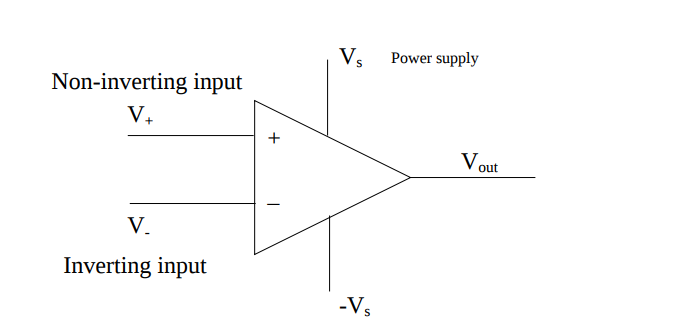

# Nuclear Electronics
Kirchoff's laws are a set of energy and charge conservation rules which aid in the analysis of electrical circuits. Kirchoff gives two laws; a current (charge) conservation law (KCL) and a voltage (energy)
conservation law (KVL).

 
#### Kirchoff's Current Law

Kirchoff's Current Law states that "the total current of charge
entering a junction or node is exactly equal to the charge leaving the
node, as charge is conserved. 
$$
    \tag{KCL}
    \sum_j{I_j} = \sum_k{I_k}
$$

 
#### Kirchoff's Voltage Law

Kirchoff's Voltage Law states that in any closed loop network, the total
voltage around the loop is equal to the sum of all voltage drops within
the same loop", which is equal to zero. 
$$
    \tag{KVL}
    \sum_j{V_i} = 0
$$

 
#### Thevenin's Theorem

Any combination of batteries and resistances with two terminals can be
replaced by a single voltage source $E$, and a single series resistor
$R$.

To calculate $E$, one must identify the "open circuit" terminals
between which the equivalent voltage and resistance must be calculated.
In the event that one is deriving the equivalent circuit for use with a
load resistor, the load resistor is removed for the subsequent
calculations.

Using KVL and KCL, we can find the open circuit potential $E$. To find
the equivalent resistance, one must first remove any voltage sources
(and consider them as simple wires), and replace any current sources
with a break or disconnect. Subsequently, simple circuit laws can be
used to find $R$.

Analogue and digital pulses
===========================

Analogue pulses are described by an instantaneous voltage amplitude
$V(t)$, and the corresponding profile drawn by $V(t)$ over a given time
interval $t_0\rightarrow t_1$.

Although analogue signals apprear continuous, there are a number of
physical constraints which determine the upper bound of the resolution
of a signal, such as the presence of interference and the physical
quantisation of charge.

Digital pulses may carry the same amount of information, but encode the
amplitude of a signal as an nbit number, conventionally in base 2.

#### Example

Let us encode an analogue signal in the range
$0\operatorname{V}\rightarrow 10\operatorname{V}$ into an integer of 16 bits.
First, we divide the amplitude range into ($2^{16}$) bins of equal
magnitude, and find the correspond bin for the input amplitude.

Let us assume an input amplitude of 5 V. This would be quantised by the
above algorithm into the $32768^{th}$ bin. This can be encoded into 16
bits as *0b1000000000000000*.

Logic
=====

There are three major conventions used to represent logic values over
analogue interfaces:

1.  Transistor-TransistorLogic (TTL)

2.  Nuclear Instrument Module (NIM)

3.  Emitter Coupled Logic (ECL/CLM)

The TTL convention defines a logical true value as a potential
difference of +5 V with respect to ground, and a false value as 0 V p.d.
with respect to ground.

The NIM convention, on the other hand, defines a true value as -0.5 V
w.r.t ground, and a false value as 0 V p.d. w.r.t ground.

Finally, the ECL convention requires that two lines are used to carry a
signal, each of an amplitude between -1.75 V and -0.75 V (true, false
for A, & false, true for B)

Charge Collection
=================

For a silicon detector, the work function for a valence electron is
$\sim 3.3\operatorname{eV}$, so for an incident $\alpha$ particle of 5 MeV, $\sim3\times10^4$ electrons are produced,
corresponding to a charge of $\sim3\times 10^{-13}\operatorname{C}$.

Gas Ionisation Counters
-----------------------

Gas ionisation counters leverage the ionisation of gas atom/molecules as
charged particles enter the ionisation chamber, which generates
electrionion pairs.

For gas ionisation counters, the ionisation energies are much greater,
typically , and thus the measured charge is a similar factor lesser than
that of a silicon detector.

Given that the mobility of electrons and ions within a gas ionisation
counter differ, the current at the anode and cathode will differ
accordingly. Therefore, one must take the integral of the current over a
suitable integration period to compare the energy deposited within the
counter from each branch.

Amplifiers
==========

Most amplifiers utilise Operational Amplifiers (OpAmps) which amplify
input signals using transistors. Such devices typically have open loop
(no feedback) gains of up to .

OpAmps have an inverse gainfrequency response, which yields a decrease
in gain as frequency increases. This can be shown with a number of
linear regions using a *Bode plot*.

There are a number of requirements for an "ideal Op-Amp":

1.  Large open loop gain $\sim \infty$

2.  Infinite input resistance (draws little current)

3.  Low output resistance (output voltage unaffected by load)

4.  Perfect differential amplifier ($V_\text{out}=A(V_{+}-V_{-})$)

Real op amps will saturate at the supply voltage, and do not exhibit a
zero intercept when plotting the output voltage against the differential
input voltage.

In addition, the amplifier gain depends upon both temperature and time
(it exhibits an ageing phenomenon). In order to stabilise the gain, a
negative feedback loop should be introduced.

There are two configurations of negative feedback that are typically
used:

1.  Noninverting

2.  Inverting

The non inverting configuration employs a potential divider between the
output and ground, with the divider output established as the inverting
input. The gain in this configuration is given as
$$A_\text{non-inv}=\frac{R_1+R_2}{R_1}\,.$$

The inverting configuration moves the potential divider to span between
the inverting input and the opamp output, with the divided voltage
connected to the inverting input and the noninverting input connected to
ground,

$$A_\text{inv}=-\frac{R_2}{R_1}\,.$$

From the schematics, it can be seen that the noninverting configuration
is one of high input impedance, whilst the inverting configuration has a
low input impedance. For the use of an OpAmp as a preamplifier for a
radiation detector, it is desirable to maximise the charge collection
from the detector, and hence a low impedance configuration (inverting)
is chosen.

It can be shown that in the inverting configuration, the potential at
the inverting input $V_-$ is given as
$$V_-=V_\text{in}\frac{R_2/(1+A)}{R_1+R_2/(1+A)}\,.$$ For $A\rightarrow \infty$,
it follows that $V_-\rightarrow 0\operatorname{V}$, and consequently we
consider the input $V_-$ to be a "virtual earth".

Charge Sensitive Amplifier
--------------------------

Typical amplifiers quantify the deposited energy of incident radiation
as liberated charge. Consequently, it is desirable to measure the
charge, and not the amplitude, yielded by the detector. For this, one
requires a "charge senstive amplifier".

To develop a CSP (charge sensitive preamplifier), one can replace the
second resistor $R_2$ in the previous configuration for a capacitor.

The current through a capacitor is given by the relationship
$$\begin{aligned}
Q_c(t) &= CV_c(t) \\
\frac{\mathrm{d}c}{\mathrm{d}t} = I_c(t) &= C\frac{\mathrm{d}c}{\mathrm{d}t}\,.\end{aligned}$$

Given that the virtual earth condition gives $V_-=0$, $V_c=-V_\text{out}$.
The current across the capacitor is equal to the current through $R$, as the opamp has infinite resistance, and therefore we deduce the following relation

$$
\begin{aligned}
    I_c(t) &= -C\frac{\mathrm{d}V_\text{out}}{\mathrm{d}t}\\
    \int_0^t{I_\text{in} \,\mathrm{d} t} = Q_\text{tot}^{0\rightarrow t} &= -C\int_0^V{\,\mathrm{d} V_\text{out}} = CV_\text{out}(t) \\
    V_\text{out}(t) = -\frac{Q_\text{tot}^{0\rightarrow t}}{C}\,.\end{aligned}
$$

Hence, in this configuration, the output voltage is the integral of the
current from the detector.

Finally, a resistor can be added in parallel with the capacitor to
prevent saturation of the output (by discharging the capacitor)

Complex Impedance
=================

Phasors
-------

A phasor is represented by a constant complex number, expressed in
exponential form, which describes the complex amplitude (in magnitude
and phase) of a sinusoidal function of time. They are used to simplify
computations involving sinusoids from differential problems to algebraic
ones.

$$\begin{aligned}
    \vec{V}(t) &= \lvert\vec{V}\rvert e^{i(\omega t+\phi_V)}\\
    \vec{I}(t) &= \lvert\vec{I}\rvert e^{i(\omega t+\phi_I)}\\
    \end{aligned}$$

Ohms law also holds with phasors: 
$$
    \vec{V}(t) = \vec{I}(t) \vec{Z}\,.
$$

Resistors
---------

The complex impedance of a resistor is simply the real resistance of the
component.

Capacitor
---------

The capacitor voltage charge relation $$Q_c(t)=CV_c(t)$$ can be
differentiated to give the current as a function of the voltage
$$I_c(t) = C\frac{\mathrm{d}c}{\mathrm{d}t}\,.$$

If we represent these values as complex numbers, where $$\begin{aligned}
        \vec{V}(t) &= \lvert\vec{V}\rvert e^{i(\omega t+\phi_V)}\\
        \vec{I}(t) &= \lvert\vec{I}\rvert e^{i(\omega t+\phi_I)}\,,
    \end{aligned}$$

then it follows that
$$\begin{aligned}
        \vec{I}(t) &= C\frac{\mathrm{d}\vec{V}(t)}{\mathrm{d}t} \\
                   &= C\lvert\vec{V}\rvert e^{i(\omega t+\phi_V)}i\omega \\
                   &= i\omega C\vec{V}(t)\,, \\
        \vec{Z} &= \frac{1}{i\omega C}\,.
    \end{aligned}
$$

Inductor
--------

The inductor voltage charge relation $$V_l(t) = L\frac{\mathrm{d}L}{\mathrm{d}t}$$

can also be rewritten using complex values.

If we represent these values as complex numbers as above, then

$$\begin{aligned}
        \vec{V}(t) &= L\frac{\mathrm{d}\vec{I}(t)}{\mathrm{d}t}\\
         &= L\lvert\vec{I}\rvert e^{i(\omega t+\phi_I)}i\omega  \\
         &= i\omega L\vec{I}(t)\,,\\
        \vec{Z} &= i\omega L\,.
    \end{aligned}$$

Filters
=======

Basic highpass and lowpass filtering can be performed with CR and RC
circuits, removing high and low frequencies respectively.

An RC circuit is in effect an integrator of the input current. In the
event that a voltage source is used, then the output voltage is
proportional to the time integral of the voltage.

A CR circuit, on the other hand, is a differentiator. Note that the
theory behind these behaviours is particular for AC circuitry.

The use of both a high and low pass filter compresses the signal within
a particular frequency range, which consequently maximises the signal to
noise ratio.

Typically the RC/CR time constants $\tau$ are set equal to one another,
and in the range for silicon detectors. It is important to choose a
sensible value for $\tau$, as it defines both the bandwidth and the
integration period of the amplifier. Where $\tau$ is less than the
charge collection time of the detector, a phenomenon known as *ballistic
deficit* is observed.

Amplifier Pulse Shape
---------------------

For a preamplifier signal with a long decay time and short rise time
(e.g 50, 1), it can be first approximated to a step function.

The first derivative of a step function *using a CR filter* gives a step
with an exponential tail.

Integrating that signal with an RC filter yields a unipolar pulse, which
can then be differentiated to give a bipolar pulse.

### The Undershoot Problem

In reality, however, preamplifier pulses have the form of a step rise
and exponential tail. When using a differentiation network where the
time constant $\tau_d < \tau_p$ (time constants of differentiation
network and preamplifier pulse), an undershoot is formed after the
initial peak. If subsequent pulses arrive on the tail of the pulse, low
energy peaks will be formed in the pulse height spectrum, degrading the
resolution.

This can be solved with the addition of an extra resistor in parallel
with the capacitor in the differentiation network, which modifiers the
response to regain the exponential decay as follows
$$\tau^\prime = \tau \frac{R}{R+R_\text{pz}}\,.$$

With too much compensation, $\tau_d$ is modified such that it is greater
than $\tau_p$, which leads to a deformed exponential tail, rather than a
symmetrical unipolar pulse.

Pile Up
-------

At high count rates, subsequent pulses can form on the tail of an
initial pulse, which leads to increasing pulse amplitudes. This
phenomenon, known as *pile up*, depends upon the event rate and pulse
length, and gives rise to high energy tails on peaks in energy spectra.

Pile up can be rejected, if a *pile up rejection* pulse is generated
when the incident pulse crosses a threshold in the positive direction.
Where two rejection pulses appear in coincidence, the event is rejected

A CR and RC circuit can be combined to form an RC shaping amplifier,
with the use of an x1 Buffer amplifier to decouple the two circuits (it
has a very high input impedance)

Baseline shift
--------------

Because capacitors cannot conduct direct current, the *average* dc
voltage at any point behind the capacitor in an RC/CR circuit must be
zero.

The mean value of a function can be defined in the form of an integral
of the function over a bounded range (if $f$ is continuous), as

$$\langle{V}\rangle = \frac{1}{b-a}\int_{t=a}^{t=b}{V(t)\,\mathrm{d}{t}}\,.$$

Hence, for $\langle{V}\rangle=0$, it must be that the integral of $V(t)$ over
the appropriate integration period is zero.

Given this constraint, it can be seen that the baseline against which an
incoming pulse train is set must be depressed below the true "zero",
such that the areas above and below the zero axis are equal.

To satisfy this constraint, the baseline shift must be dependant upon
the pulse frequency. Hence, with signals from real detectors
(preamplifiers), energy resolution will be degraded ($E\propto V$).

One can satisfy the necessary equal areas criterion whilst avoiding
baseline shift by using bipolar pulses, whch have equal areas above and
below the baseline. Another solution is to use a baseline restoration
circuit, which resets the dc level to zero after each pulse

Discriminators
==============

First Level Discriminators
--------------------------

Discriminators are used to detect pulses within a signal. A naive
amplitudedependant trigger such as a "window discriminant" will
trigger at different points along the pulse profile, depending upon the
pulse shape and amplitude, in a phenomenon known as *time walk*. See for
more.

Second Level Discriminators
---------------------------

Second level discriminators use comparisons *between logic pulses*,
rather than a single pulse and some constant criterion.

Coincidence units produce a logic pulse from each amplified signal
branch, and then feed them into a coincidence unit. These units can
perform AND/OR tests to reject or accept the event.

Some coincidence units have *veto* inputs, which overrides the
coincidence logic to reject an event, provided that the pulse spans the
pulses from both A and B.

This feature is typically used by the data acquisition system (DAS),
which is unable to process further events whilst active (corresponding
to the DAS *dead time*, often in the range of depending upon DAS
complexity).

Digital Conversion
==================

An ADC converts an analogue pulse into a digital amplitude as follows:

1.  The peak amplitude is located using peak detection (differentiating
    to find the zerocrossing point).

2.  The peak amplitude is then held constant for processing

3.  A digitisation routine quantifies the voltage as a digital value.

There are several approaches to digitisation, Wilkinson and Successive
Approximation.

Linearity
---------

There are two aspects to the linearity of an ADC, which describe its
linear behaviour:

1.  Integral nonlinearity, the maximum deviation of the digitised vs
    amplitude curve from the line of best fit.
    $$\operatorname{INL} = \max_{0\le c\le c_\text{max}}{\lvert V_\text{out}(c)-V_\text{out}(0) - c\times m\rvert }$$

2.  Differential nonlinearity, the difference between the channel width
    and the ideal width as a fraction of the ideal.
    $$\operatorname{DNL}(i) = \frac{V_\text{out}(i+1)-V_\text{out}(i)}{\,\mathrm{d}{w}_\text{ideal}} - 1$$

The Wilkinson Method
--------------------

The Wilkinson method involves charging a capacitor to the held voltage
$V$, and then counting the number of clock pulses which elapse as it
discharges through a constant current source, before a discriminator
measures a zero voltage across the capacitor.

Given that the voltage across a capacitor discharging through a constant
current source is described by the relation 
$$\begin{aligned}
            i&=i_c=c\frac{\mathrm{d}c}{\mathrm{d}t}\\
            \int_0^T{\frac{i}{C}\,\mathrm{d}{t}} &= V_0 = \frac{iT}{C}\,.
        \end{aligned}
$$

The time taken for the capacitor to discharge can be used to determine
the initial voltage. Evidently the uncertainty in the digitised voltage
is dependant upon the clock frequency.

The $\operatorname{INL}$ of this method depends upon the capacitor and current source,
whilst the $\operatorname{DNL}$ depends upon, in particular, the clock characteristics.

The Successive Approximation Method
-----------------------------------

The successive approximation method uses an iterative algorithm which
utilises a fixed number of bits to encode the voltage as a digital
value. The algorithm decomposes the voltage as a sum of fractional
powers of a known maximum voltage.

Because the method uses a fixed number of iterations, independent of
voltage, it is typically fast. It also exhibits good $\operatorname{INL}$ but poor
$\operatorname{DNL}$.

The *sliding scale principle* can be used to improve differential
nonlinearity, whilst worsening resolution. The method involves adding a
random (known) analogue voltage to the ADC input, and subtracting the
digital representation at the end

Flash ADC
---------

This method "brute forces" the AD problem by using N window
discriminators, which correspond to N equally spaced channels.

Given that each "bin" requires a discriminator, this approach is
crude, and exhibits poor linearity and limited resolution.

TThis is the first lemma of the lecture.
