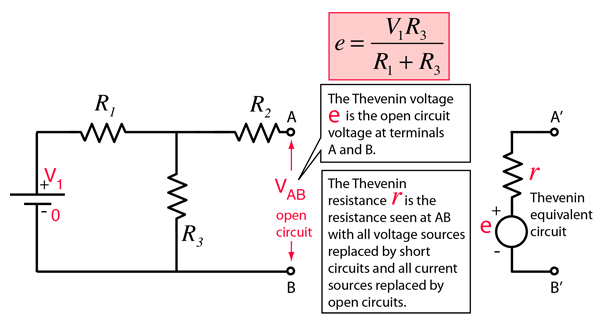
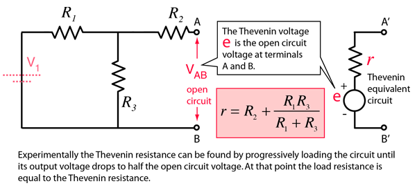

Basic Electronic Circuits
=========================

Phasors
-------

A phasor is a complex number, expressed in exponential form, which represents a sinusoidal function whose magnitude, angular frequency, and phase are constant in time. They are used to simplify computations involving sinusoids from differential problems to algebraic ones.

The voltage and current of a circuit may be expressed as phasors with angular frequencies $\phi_V$ and $\phi_I$, respectively:
$$\begin{aligned}
    \vec{V}(t) &= \lvert\vec{V}\rvert e^{i(\omega t+\phi_V)}\\
    \vec{I}(t) &= \lvert\vec{I}\rvert e^{i(\omega t+\phi_I)}\,.
    \end{aligned}
$$

Ohms law also holds with phasors, 
$$
    \vec{V}(t) = \vec{I}(t) \vec{Z}\,,
$$
where $Z$ is the _complex impedence_.

Resistors
---------

The complex impedance of a resistor is simply the real resistance of the
component.

Capacitor
---------

The capacitor voltage charge relation $$Q_c(t)=CV_c(t)$$ can be
differentiated to give the current as a function of the voltage
$$I_c(t) = C\frac{\mathrm{d}V_c}{\mathrm{d}t}\,.$$

If we represent these values as complex numbers, where $$\begin{aligned}
        \vec{V}(t) &= \lvert\vec{V}\rvert e^{i(\omega t+\phi_V)}\\
        \vec{I}(t) &= \lvert\vec{I}\rvert e^{i(\omega t+\phi_I)}\,,
    \end{aligned}$$

then it follows that
$$\begin{aligned}
        \vec{I}(t) &= C\frac{\mathrm{d}\vec{V}(t)}{\mathrm{d}t} \\
                   &= C\lvert\vec{V}\rvert e^{i(\omega t+\phi_V)}i\omega \\
                   &= i\omega C\vec{V}(t)\,, \\
        \vec{Z} &= \frac{1}{i\omega C}\,.
    \end{aligned}
$$

Inductor
--------

The inductor voltage charge relation $$V_l(t) = L\frac{\mathrm{d}L}{\mathrm{d}t}$$

can also be rewritten using complex values. If we represent these values as complex numbers as above, then

$$\begin{aligned}
        \vec{V}(t) &= L\frac{\mathrm{d}\vec{I}(t)}{\mathrm{d}t}\\
         &= L\lvert\vec{I}\rvert e^{i(\omega t+\phi_I)}i\omega  \\
         &= i\omega L\vec{I}(t)\,,\\
        \vec{Z} &= i\omega L\,.
    \end{aligned}$$
    
Circuit Laws
------------
Kirchoff's laws are a set of energy and charge conservation rules which aid in the analysis of electrical circuits. Kirchoff gives two laws; a current (charge) conservation law (KCL) and a voltage (energy)
conservation law (KVL).

 
#### Kirchoff's Current Law

Kirchoff's Current Law states that "the total current of charge
entering a junction or node is exactly equal to the charge leaving the
node, as charge is conserved. 
$$
    \tag{KCL}
    \sum_j{I_j} = \sum_k{I_k}
$$

 
#### Kirchoff's Voltage Law

Kirchoff's Voltage Law states that in any closed loop network, the total
voltage around the loop is equal to the sum of all voltage drops within
the same loop", which is equal to zero. 
$$
    \tag{KVL}
    \sum_j{V_i} = 0
$$

 
#### Thevenin's Theorem
Any combination of batteries and resistances with two terminals can be
replaced by a single voltage source $e$, and a single series resistor
$R$.
To calculate $e$, one must identify the "open circuit" terminals between which the equivalent voltage and resistance must be calculated. In the event that one is deriving the equivalent circuit for use with a load resistor, the load resistor is removed for the subsequent calculations. Using **(KVL)** and **(KCL)**, we can find the open circuit potential $e$. 

To find the equivalent resistance, one must first remove any voltage sources (and consider them as simple wires), and replace any current sources with a break or disconnect. Subsequently, simple circuit laws can be used to find $R$.

