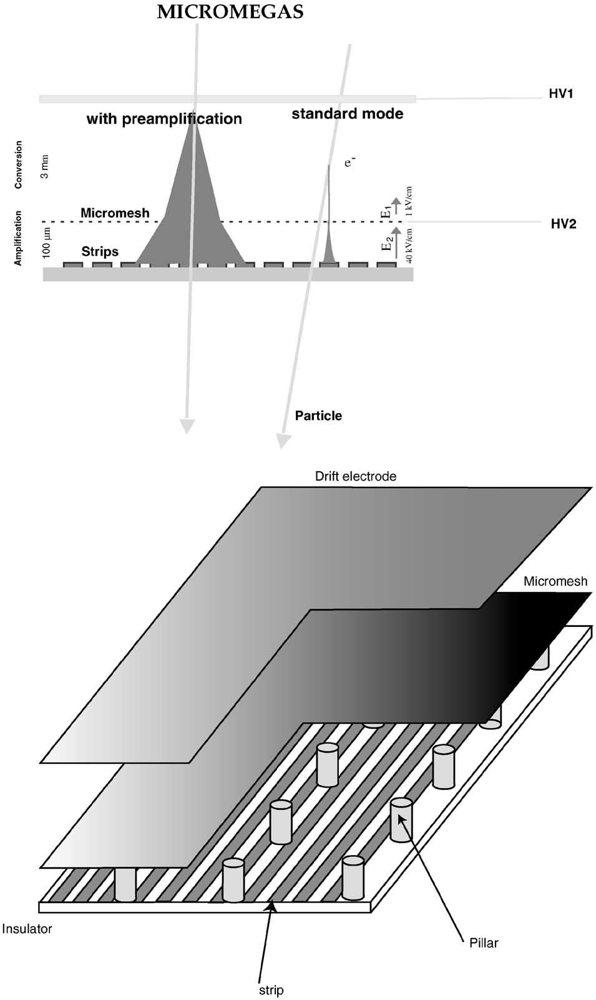
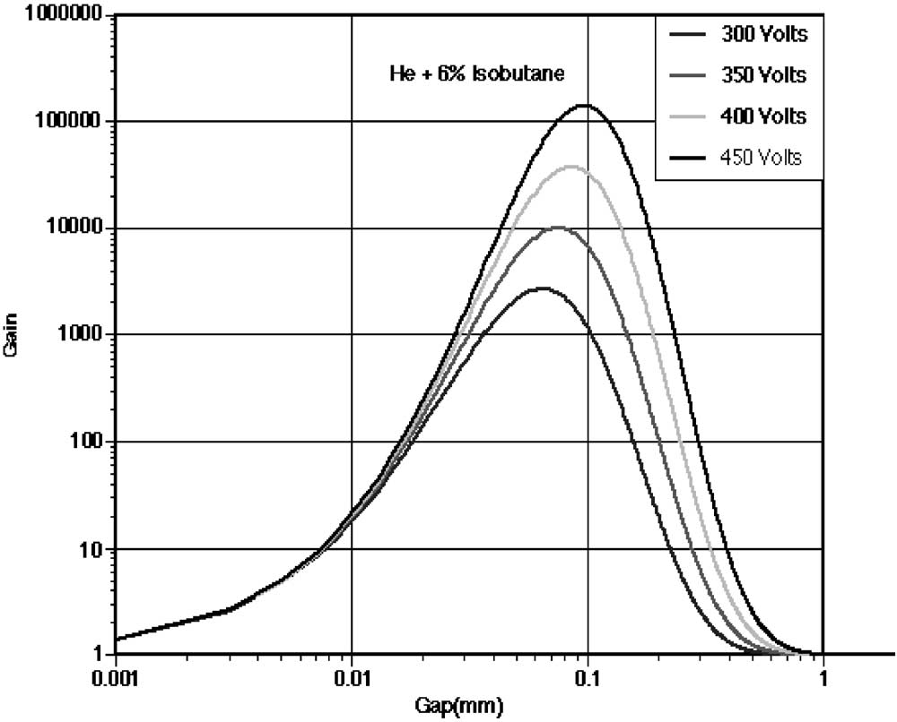
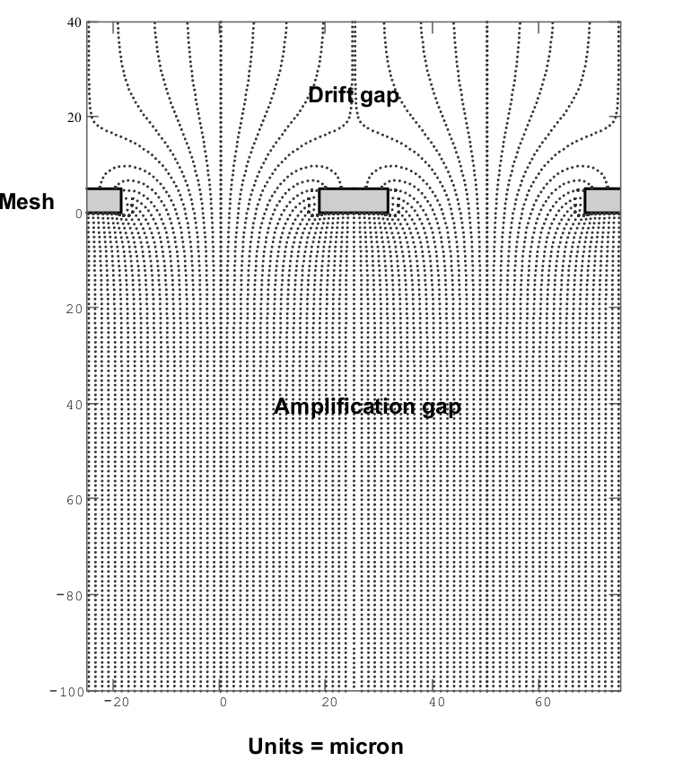

# MicroMegas Detector

The MicroMegas detector is a gaseous, parallel-plate detector, with a very narrow amplification space, operating at atmospheric pressure. From [a paper introducing its properties](https://www.sciencedirect.com/science/article/pii/S0168900201017132?via%3Dihub):

   

> The MicroMegas detector operates as a two-stage parallel-plate
avalanche chamber. It consists of a small amplification gap ($50\text{\textendash}
300\operatorname{\mu m}$) and a much larger drift gap (on the order of $\operatorname{cm}$) separated
by a thin electroformed micromesh. It has been shown to provide
gains of up to $10^5$

The gain of the detector as a function of the amplification gap $a$ has a maximum (and hence, is most stable with $\frac{\mathrm d G}{\mathrm d a}\approx 0$) around $50\operatorname{\mu m}$. By operating in this region, small variations of the gas pressure, or variations in flatness of the micromesh, do not adversely affect the gain. 

   

The uniformity of the electric field ensures that the avalanche from gas multiplication in the amplification gap remains stable. The electric field is disturbed, however, around the holes of the micromesh.
   
In the aforementioned paper, it is mentioned that for particular field strengths, electrons are not likely to caught by returning field lines to underside of the mesh:
> With a thin micromesh, as long as the amplification field is one order of magnitude larger than the field in the conversion region, any field line coming from the top of the mesh does not return to the bottom of the mesh.

