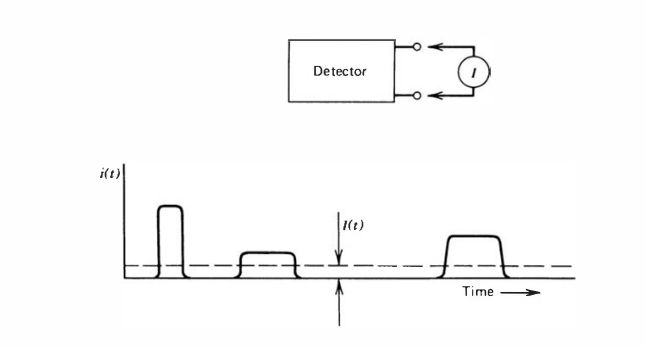
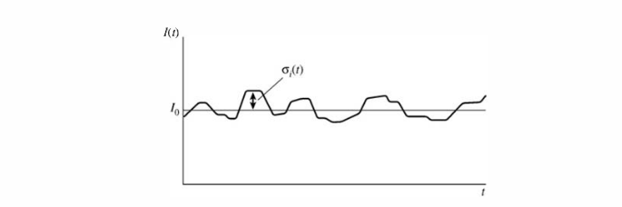
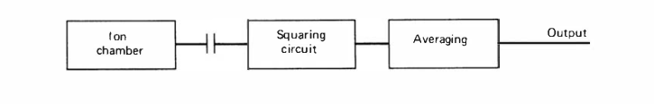

Operation Modes
===============

Current Mode
------------
Consider a circuit in which the current through the output terminals of a detector is recorded by a measuring device. 

If we assume that this measuring device has a fixed response time $T$, then the recorded signal from a series of events will be a time dependent current given by
$$
I(t) = \frac{1}{T}\int_{t-T}^ti(t^\prime)\,\mathrm{d}t^\prime\,.
$$

Given that the response time $T$ will typically exceed the event arrival time, it equivalent to a the rolling-average of the current, and hence will lose information about the deposition of individual quanta. 

The _average_ current is give by the product of the interaction rate and the average charge per interaction.
$$
\tag{a}
I_0 = rQ = r\frac{E}{W}q\,,
$$
where $W$ is the work function to produce a unit charge pair (e.g. electron ion pair), $Q$ the charge liberated for each event, $E$ the average energy deposited per event, and $r$ the event rate. We can express $I(t)$ in terms of this baseline current, as
$$
I(t) = I_0 + \sigma_i(t)\,,
$$
where $\sigma_i(t)$ is a random time-dependent variable $\sigma_i(t) \sim \sigma_I(t)$ according to the radiation events interacting within the detector.

Given that $I_0$ is the _average_ current, it follows that the variance is 
$$
    \overline{\sigma_I^2(t)} = \frac{1}{T}\int_{t-T}^t{I(t^\prime)-I_0}\,\mathrm{d}t\,,
$$
and the standard deviation is
$$
    \tag{b}
    \overline{\sigma_I(t)} = \sqrt{\overline{\sigma_I^2(t)}}\,.
$$

Mean Square Voltage Mode
------------------------
If we have some componentw which blocks the average current $I_0$, and passes only $\sigma_i(t)$, then we can construct a circuit which computes the time average of the squared amplitude of $\sigma_i(t)$.

This circuit will compute **(b)**. Where each event deposits the same charge, and inter-event arrival time is a Poisson process, then the fractional standard deviation is 
$$
\frac{\overline{\sigma_I(t)}}{I_0} = \frac{\sigma_n}{n} = \frac{1}{\sqrt{n}} = \frac{1}{\sqrt{rT}}\,.
$$

Hence, we can find **(b)** as 
$$
\overline{\sigma_I^2(t)} = \frac{rQ^2}{T}\,.
$$
Evidently, events with larger charge more strongly bias the output, and so MSV mode is used to discriminate in favour of events which liberate more charge.

Pulse Mode
----------
Detectors are operated in pulse mode by measuring the time dependent voltage $V_R(t)$ across the load resstance in an RC circuit. This mode *preserves the nature of the amplitude and timing* of the pulse.

There are two extremes of operation, dependent upon the [RC circuit](rc-circuits.md#RC-Circuit) time constant $\tau=RC$, where the capacitance $C$ is the equivalent capacitance of both the detector and the measuring circuit.

By [Kirchoff's Voltage Law](basic-electronics.md#Kirchoff's-Voltage-Law), the output voltage $V_R$ will be equal to $V_C$.

### Deriving $V_C(t)$
For an RC circuit with source current $I_s=I_C+I_R$, it follows that
$$
    \tag{c}
    I_s = C\frac{\mathrm{d}V_C}{\mathrm{d}t} + \frac{V_C}{R}\,.
$$

To solve this, let's introduce an function $M(t)$, and multiply through 
$$
    \tag{d}
    M(t)C\frac{\mathrm{d}V_C}{\mathrm{d}t} + M(t)\frac{V_C}{R} = M(t)\frac{I_s}{C}\,.
$$
By choosing $M(t)=e^{\int{\frac{1}{RC}\,\mathrm{d}t}}=e^{\int{\frac{1}{\tau}\,\mathrm{d}t}}$, it follows that
$$
\frac{\mathrm{e}M(t)}{\mathrm{d}t} = \frac{1}{\tau}M(t)\,,
$$

hence we can rewrite **(d)** as
$$
    \frac{\mathrm{d}}{\mathrm{d}t}\Big(M(t)V_C\Big) = M(t)\frac{I_s}{C}\,,
$$

taking the integral of both sides from $t=0$ to $t=t$ and solving for $V_C$, we find
$$
V_C(t) = \frac{1}{M(t)}\left(V_C(0)M(0) + \frac{1}{C}\int_0^t M(t^\prime)I_s\,\mathrm{d}t^\prime\right)\,.
$$

As $M(t)$ can be any function which satisfies $M^\prime = \frac{1}{\tau}M$, let $M(t) = \exp\left(\int_0^t \frac{1}{\tau}\,\mathrm{d}t\right)=\exp(\frac{t}{\tau})$,
$$
    V_C(t) = \exp\left(\frac{-t}{\tau}\right)\left(V_C(0) + \frac{1}{C}\int_0^t \exp\left(\frac{t^\prime}{\tau}\right)I_s\,\mathrm{d}t^\prime\right)\,.
$$

Evidently, at $t=0$, the voltage on the capacitor $V_C$ must be zero, hence
$$
    \tag{d}
    V_C(t) = \exp\left(\frac{-t}{\tau}\right)\frac{1}{C}\int_0^t \exp\left(\frac{t^\prime}{\tau}\right)I_s\,\mathrm{d}t^\prime\,.
$$

### Small $\tau$
Let us rewrite **(c)** in terms of $\tau$
$$
\tag{f}
R I_s = \tau\frac{\mathrm{d}V_C}{\mathrm{d}t} + V_C\,.
$$

Taking the limit as $\tau \rightarrow 0$, it follows that $I_s \approx \frac{V_C}{R}$. Consequently, detectors are operated in this regime in cases where fast timing is required.

### Large $\tau$
Where $\tau \rightarrow \infty$, **(e)** approaches
$$
    V_C(t) = \frac{1}{C}\int_0^t I_s(t^\prime) \,\mathrm{d}t^\prime\,.
$$

This can also be shown from **(f)**, with $I_s \approx C \frac{\mathrm{d}V_C}{\mathrm{d}t}$.

In this regime, the rise time of $V_C$ depends solely upon the charge collection time within the detector, whereas the decay time depends upon the time constant of the load circuit.

The output voltage $V_c$ is inversely proportional to the capacitance $C$. In _some_ detectors (e.g. the semiconductor diode detector), this value depends upon the degree of charge deposited. In these cases, a [charge-sensitive preamplifier](electronics.md#Charge-Sensitive-Amplifier) is used to eliminate the dependence of the output amplitude upon $C$.