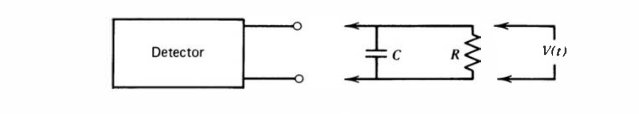

Operation Modes
===============

Pulse Mode
----------
Pulse mode involves recording the time-integral of the current (such as that from a [charge-sensitive preamplifier](electronics.md#Charge-Sensitive-Amplifier)). This *preserves the nature of the amplitude and timing* of the pulse.

The voltage across the load resistor $R$ is the fundamental signal voltage, and has two extremes of operation, dependent upon the [RC circuit](rc-circuits.md#RC-Circuit) time constant $\tau=RC$.

For an RC circuit with source current $I_s=I_C+I_R$, it follows that
$$
I_s = C\frac{\mathrm{d}V_C}{\mathrm{d}t} + \frac{V_C}{R}\,.
$$

To solve this, let's introduce $M(t)=e^{\int{C\,\mathrm{d}t}}$

### Small $\tau$
Where $\tau \ll t_c$, given $t_c$ is the charge collection time, the 

### Large $\tau