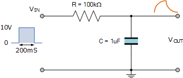
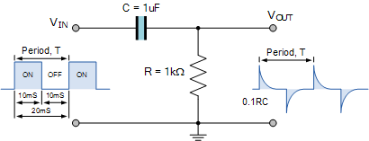

RC Circuits
===========
A resistor-capacitor (RC) circuit  (of first order) is a simple electronic circuit comprised of a resistor and capacitor.
There are typically two configurations of RC circuits, **RC** and **CR**.

RC Mode
-------

### Transfer Function
The _transfer function_ shows the dependence of the gain upon the signal frequency (for sinusoidal signals).

In RC mode, the output voltage is taken over the capacitor. Given that the impedance of a capactitor is 
$$
    Z_C=\frac{1}{i\omega C}\,,
$$
where $\omega$ is the frequency of the voltage source. We can find the votage over the capacitor $V_C$ as
$$
\begin{aligned}
V_C &= V_\text{in}\frac{Z_C}{R+Z_C}\\
    &= V_\text{in}\frac{1}{1+i\omega RC}\,.
\end{aligned}
$$

Letting $\tau = RC$, we find that
$$
V_C = V_\text{in}\frac{1}{1+i\omega\tau}\,,
$$

where $\frac{1}{1+i\omega\tau}$ is the _transfer function_.

CR Mode
-------

In CR mode, the output voltage is taken over the resistor. The voltage over the resistor is given by
$$
\begin{aligned}
V_R &= V_\text{in}\frac{R}{R+Z_C}\\
    &= V_\text{in}\frac{i\omega\tau}{1+i\omega \tau}\,,
\end{aligned}
$$

where $\frac{i\omega\tau}{1+i\omega \tau}$ is the _transfer function_.

Frequency Response
------------------
Both of these modes exhibit an output voltage dependent upon frequency. A plot of $\lvert\frac{V_\text{out}}{V_\text{in}}\rvert$ shows that the RC circuit behaves as a _low pass filter_, whilst the CR circuit behaves as a _high pass filter_.
