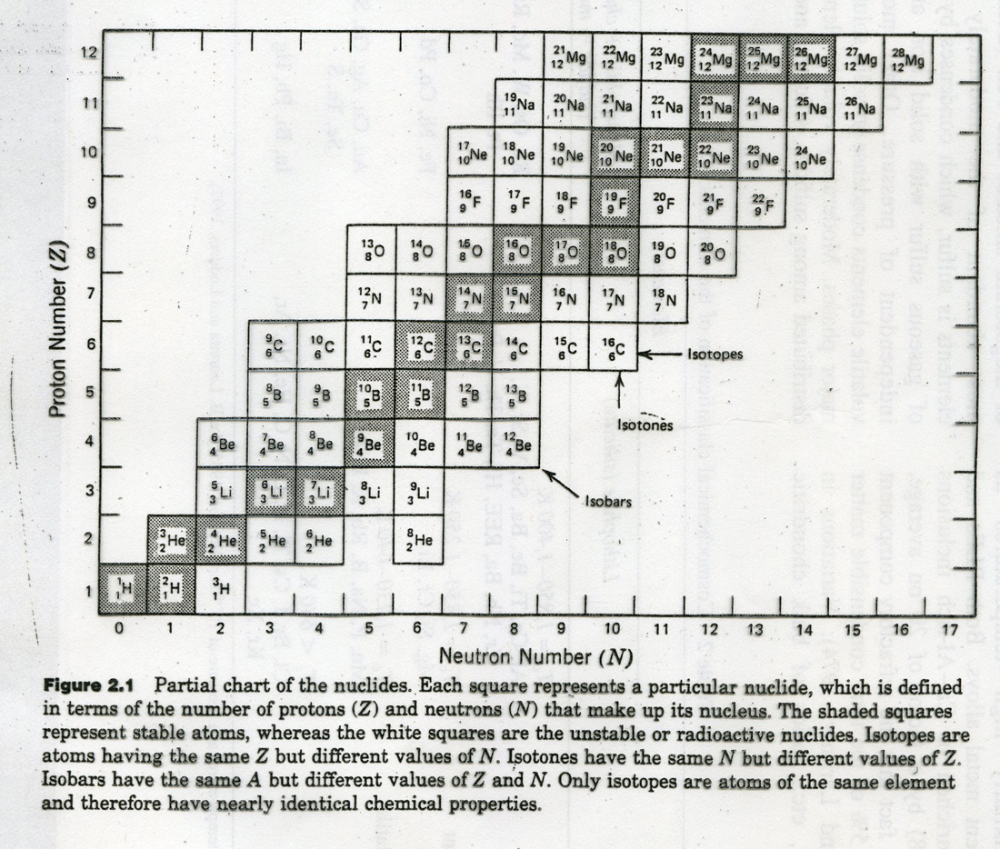

Basic Concepts
==============

Iso*tone*
  ~ Nuclides with the same neutron number $N$, but different proton number $Z$.
  
Iso*bar*
  ~ Nuclides with the same mass number $A$.
  
Iso*tope*
  ~ Nuclides with the same proton number $Z$ but different neutron numbers $N$.