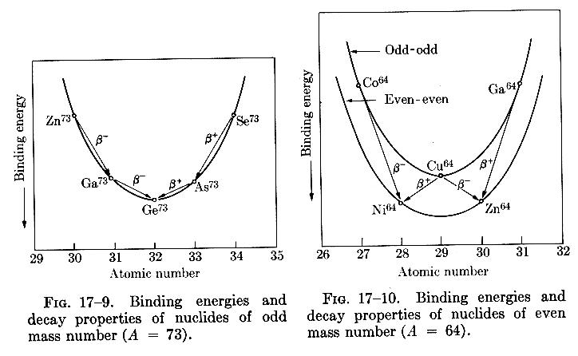

Binding Energy
==============
The mass energy $m_Nc^2$ of a nuclide is given in terms of the nuclide's _atomic_ mass energy $m_Ac^2$, the mass energy of its electrons, and their respective binding energies $B_i$:
<!-- Here the mass of the atom excludes the binding energy, so we restore it first before subtracting the isolated electron masses -->
$$
\tag{a}
m_Nc^2 = m_Ac^2+\sum_{i=1}^ZB_i-Zm_ec^2\,.
$$
Conventionally, we neglect the contribution from the electronic binding energies, as they are on the order of $\sim10\operatorname{-}100\keV$ vs $ A\times1000\MeV$

The _binding energy_ $B$ of the nucleus is the difference in mass energy between the nucleus and its constituent protons and neutrons,
$$
B = \left(Zm_p + Nm_n - \left[m(\atom{A}{X})-Zm_e\right]\right)c^2\,.
$$
This expression may be rewritten to use the atomic mass of $\atom{1}{H}$ (which includes the mass of the electrons, but does not reproduce the correct binding energy contribution):
$$
\tag{b}
B = \left(Zm(\atom{1}{H}) + Nm_n - m(\atom{A}{X})\right)c^2\,.
$$

In order to determine the _atomic_ masses, some tables give the _mass excess_
$$
\tag{c}
\Delta = m(\atom{A}{X}) - A\,.
$$
This value is _not_ directly a measure of binding energy, as the mass given by the atomic number is _relative_ to the mass of ${}^{12}\text{C}$.

The binding energy of a nucleus tends to increase linearly with the number of nucleons $A$. The average binding energy per nucleon is approximately $8\MeV$. In the figure below, there are two visible regions $A<60$ and $A>60$, in which the specific binding energy increases and decreases respectively. 

Mass Doublet Method
-------------------
Nuclear masses can be measured to precisions of $10^{-6}$ using a mass spectroscope. Mass spectroscopes begin with an ion source, followed by a *velocity selector* uses the Lorentz force (with perpendicular $E$ and $B$ fields) to select for a particular ion velocity given by
$$
    qE = qvB\,,
$$
and a subsequent *momentum selector* which employs a uniform magnetic field to bend the ion beam, with a radius $r$ determined by mass 
$$
    r=\frac{mv}{qB}\,.
$$
Often the magnetic fields of the velocity and momentum selectors are common, i.e.
$$
m = \frac{qrB^2}{E}\,.
$$

Given that the precision of the mass measurement depends upon $B$ and $E$, these values must be known precisely, which in practice proves difficult. One could calibrate to a particular mass, and subsequently determine other masses by relative measurement. To measure a large range of masses however, $E$ and $B$ would need to be varied considerably, and the calibration may not remain valid to one part in $10^{-6}$ over such a range. Rather than use an absolute calibration, one can instead measure the smaller difference between two nearly equal masses, such as those given by selected molecules. Once accelerated, these molecules lose their electrons, and the molecular binding energy is of the order $10^{-9}\amu$, thus we effectively measure only the mass of the nucleus.  
For example, one might configure the apparatus for mass $128$, and measure the difference between $\text{C}_9\text{H}_{20}$ and $\text{C}_{10}\text{H}_8$, which gives 
$$
\Delta = m\mleftright{(}{\text{C}_9\text{H}_{20}}{)} - m\mleftright{(}{\text{C}_{10}\text{H}_8}{)}=12m\mleftright{(}{\atom{1}{H}}{)}-m\mleftright{(}{\atom{12}{C}}{)}\,.
$$
The technique of measuring the small difference between close lying masses is known as the *mass doublet* method. A similar technique may be used with reaction Q values to determine nuclear masses from kinetic energy.

Separation Energies
-------------------
In addition to binding energy, we can also define the _separation energies_ of protons and neutrons within the nucleus $S_p,\,S_n$
$$
\begin{aligned}
S_p &= B\mathopen{}\left({}^A_Z\text{X}\right)\mathclose{} - B\mathopen{}\left(\nucleus{Z-1}{A-1}{X}\right)\mathclose{}\\
&= \left(m\mathopen{}\left(\nucleus{A-1}{Z-1}{X}\right)\mathclose{}-m\mathopen{}\left(\nucleus{A}{Z}{X}\right)\mathclose{}+m\mathopen{}\left(\atom{1}{H}\right)\mathclose{}\right)c^2\\ 
&\\
S_n &= B\mathopen{}\left(\nucleus{A}{Z}{X}\right)\mathclose{} - B\mathopen{}\left(\nucleus{Z}{A-1}{X}\right)\mathclose{}\\
&= \left(m\mathopen{}\left({}^{A-1}_Z\text{X}\right)\mathclose{}-m\mathopen{}\left({}^A_Z\text{X}\right)\mathclose{}+m_n\right)c^2\,.
\end{aligned}
$$
If the binding energy increases with removal of a nucleon, it is an energetically favourable process, and thus the separation energy (barrier) is _negative_.

Semi Empirical Mass Formula
---------------------------
### Volume Term
The variation of the binding energy with $A$ of a nucleus can be predicted from the _semi-empirical mass formula_. To the lowest order, $B\propto A$ (given that $\frac{B}{A}\approx 8\MeV$), hence we can establish a _volume_ term (as $V\propto A$),
$$
    \tag{a}a_vA\,.
$$
That $B$ depends upon $A$ is interesting, for it implies that the nuclear potential involves a near(est)-neighbour interaction, rather than $A(A-1)$ for all nucleons.

### Surface Term
The volume term over-estimates the contribution to the binding energy of the surface nucleons, which are surrounded by fewer neigbours and hence are less tightly bound than those in the core of the nucleus. A _surface correction_ is therefore required,
$$
    \tag{b}-a_sA^\frac{2}{3}\,.
$$

### Coulomb Repulsion
Let the nuclear radius $R$ be proportional to $A$, 
$$
    R=R_0A^\frac{1}{3}\,.
$$
As protons experience Coulomb repulsion, an additional _repulsive_ term is added to reduce the binding energy
$$
\tag{c}
-\frac{e^2}{2\pi\epsilon_0R_0A^\frac{1}{3}}kZ(Z-1) = -a_cZ(Z-1)A^{-\frac{1}{3}}\,.
$$

### Symmetry
It is observed that stable nuclei have $Z\approx\frac{A}{2}$. An additional _symmetry_ term is required to account for this increase in binding energy,
<!-- TODO motivate form of symmetry expression, mention overlap of orbitals-->
$$
\tag{d}
-a_\text{sym}\frac{(A-2Z)^2}{A}\,.
$$

### Parity
<!-- TODO mention spin coupling -->
A final term is required to account for the tendency of like nucleons to couple pairwise to particularly stable configurations. In the case that the number of protons and neutrons are fully paired ($N$, $Z$ even) there is an _increase_ $\delta_0$ in binding energy. If both $N$ and $Z$ are odd, then there are two nucleons that are unpaired, which minimises the binding energy. The case that $A$ is odd lies in between the other two. Hence,
$$
\tag{e}
\delta=\begin{cases}
    +\delta_0,& \text{M, Z even} \\
    0,              & \text{A odd} \\
    -\delta_0,& \text{M, Z odd} \\
\end{cases}
$$

---

The final expression for the binding energy $B$ is therefore
$$
\tag{f}
B = a_vA - a_sA^\frac{2}{3} - a_cZ(Z-1)A^{-\frac{1}{3}} - a_\text{sym}\frac{(A-2Z)^2}{A} + \delta\,,
$$

where experimentally the constants have been found as follows
| Constant       	| Experimental Value / MeV 	|
|----------------	|--------------------	|
| $a_v$          	| $15.5$ 	|
| $a_s$          	| $16.8$ 	|
| $a_c$          	| $0.72$ 	|
| $a_\text{sym}$ 	| $23$   	|
| $\delta_0$     	| $34$   	|

Using this expression for $B$, we have the _semi-empirical mass formula_
$$
M(Z,A) = Zm\mathopen{}\left(\atom{1}{H}\right)\mathclose{} + Nm_n - \frac{B(Z,A)}{c^2}\,.
$$

### Mass Chains
The figure below shows $M(Z,A)$ for fixed $A$ shows the decay chain for $A=73$ and $A=64$.

* In the case that $A$ is odd, then we see a single mass energy (stability) curve. Isobars on either side of the minimum (stable) isobar decay via $\beta$ decay towards the minimum to become more stable.
* When $A$ is even, there are two stability curves, for (a) odd-$N$, odd-$Z$, (b) even-$N$, even-$Z$. This splitting results from the contribution to $M(Z,A)$ from the parity term $\delta$, giving a separation of $2\delta_0$ between the two parabolas. Consider the nuclide $\atom{64}{Cu}$; as it lies on the upper stability curve, it can decay towards the lower stability curve in either direction to become even-$N$, even-$Z$. This is distinct from the odd-$A$ curve, in which decays occur in one direction _only_ (towards stability).

