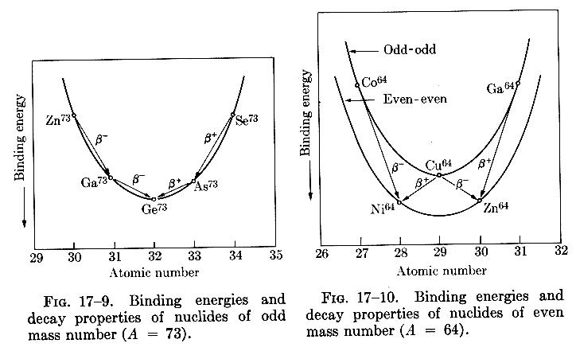

Semi Empirical Mass Formula
===========================
Volume Term
-----------

The variation of the binding energy with $A$ of a nucleus can be predicted from the _semi-empirical mass formula_. To the lowest order, $B\propto A$ (given that $\frac{B}{A}\approx 8\unit{\MeV}$), hence we can establish a _volume_ term (as $V\propto A$),

$$
    \tag{a}a_vA\,.
$$

That $B$ depends upon $A$ is interesting, for it implies that the nuclear potential involves a near(est)-neighbour interaction, rather than $A(A-1)$ for all nucleons.

Surface Term
------------

The volume term over-estimates the contribution to the binding energy of the surface nucleons, which are surrounded by fewer neigbours and hence are less tightly bound than those in the core of the nucleus. A _surface correction_ is therefore required,

$$
    \tag{b}-a_sA^\frac{2}{3}\,.
$$

Coulomb Repulsion
-----------------

Let the nuclear radius $R$ be proportional to $A$,

$$
    R=R_0A^\frac{1}{3}\,.
$$

As protons experience Coulomb repulsion, an additional _repulsive_ term is added to reduce the binding energy

$$
\tag{c}
-\frac{e^2}{2\pi\epsilon_0R_0A^\frac{1}{3}}kZ(Z-1) = -a_cZ(Z-1)A^{-\frac{1}{3}}\,.
$$

Symmetry
--------

It is observed that stable nuclei have $Z\approx\frac{A}{2}$. An additional _symmetry_ term is required to account for this increase in binding energy,

<!-- TODO motivate form of symmetry expression, mention overlap of orbitals-->

$$
\tag{d}
-a_\text{sym}\frac{(A-2Z)^2}{A}\,.
$$

Parity
------

<!-- TODO mention spin coupling -->

A final term is required to account for the tendency of like nucleons to couple pairwise to particularly stable configurations. In the case that the number of protons and neutrons are fully paired ($N$, $Z$ even) there is an _increase_ $\delta_0$ in binding energy. If both $N$ and $Z$ are odd, then there are two nucleons that are unpaired, which minimises the binding energy. The case that $A$ is odd lies in between the other two. Hence,

$$
\tag{e}
\delta=\begin{cases}
    +\delta_0,& \text{M, Z even} \\
    0,              & \text{A odd} \\
    -\delta_0,& \text{M, Z odd} \\
\end{cases}
$$

---

The final expression for the binding energy $B$ is therefore

$$
\tag{f}
B = a_vA - a_sA^\frac{2}{3} - a_cZ(Z-1)A^{-\frac{1}{3}} - a_\text{sym}\frac{(A-2Z)^2}{A} + \delta\,,
$$

where experimentally the constants have been found as follows
| Constant | Experimental Value / MeV |
|---------------- |-------------------- |
| $a_v$ | $15.5$ |
| $a_s$ | $16.8$ |
| $a_c$ | $0.72$ |
| $a_\text{sym}$ | $23$ |
| $\delta_0$ | $34$ |

Using this expression for $B$, we have the _semi-empirical mass formula_

$$
M(Z,A) = Zm\mathopen{}\left(\atom{1}{H}\right)\mathclose{} + Nm_n - \frac{B(Z,A)}{c^2}\,.
$$

Mass Chains
---

The figure below shows $M(Z,A)$ for fixed $A$ shows the decay chain for $A=73$ and $A=64$.

- In the case that $A$ is odd, then we see a single mass energy (stability) curve. Isobars on either side of the minimum (stable) isobar decay via $\beta$ decay towards the minimum to become more stable.
- When $A$ is even, there are two stability curves, for (a) odd-$N$, odd-$Z$, (b) even-$N$, even-$Z$. This splitting results from the contribution to $M(Z,A)$ from the parity term $\delta$, giving a separation of $2\delta_0$ between the two parabolas. Consider the nuclide $\atom{64}{Cu}$; as it lies on the upper stability curve, it can decay towards the lower stability curve in either direction to become even-$N$, even-$Z$. This is distinct from the odd-$A$ curve, in which decays occur in one direction _only_ (towards stability).
