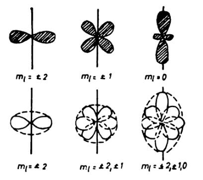

Single Particle Models
======================

Core Polarisation
-----------------
$\atom{16}{O}$ has $Q=0$, so one would expect $\atom{17}{O}$ to also have $Q=0$, as neutrons are uncharged. We actually observe a small non-zero $Q$, which suggests that the neutron *polarises* the core, inducing a small oblate deformation. This results from correlations induced by the residual interaction $V$.

*(a) an unpolarised nucleus. (b) the polarisation effect of the nucleus caused by the residual interaction between the nucleus and the core.*
<!-- Although we retain the residual interaction, it doesn't act on the core as we only define it for the active space -->

Pairing
-------
All even-even nuclei are observed to have $J^\pi=0^+$ ground states. This provides evidence for the nuclear pairing force term in the [semi empirical mass formula](binding-energy.md#Parity), as nucleons (of the same isospin)  couple in pairs to spin $J=0$. In the shell model, this is accounted for by the residual interaction. This coupling occurs such that they occupy time-reversed spin anti-aligned orbits[^krane.74], leaving the nuclear angular momentum $I=0$. It is this pairing energy ($\sim 1\MeV$ for two $J=0$ protons[^fonm.27]) that leads to the first excited states of even-even singly-closed nuclei being at least $1\MeV$ above the ground state.[^fonm.33] Frequently, even-even singly-closed nuclei have a $2^+$ first excited state due to a single broken pair of nucleons recoupling (in the same sub-shell) to $J^\pi=2^+$.[^fonm.33] It follows that odd-$A$ nuclei therefore must have $I$ equal to the $j$ of the odd (unpaired) proton or neutron. 

*Top: Density distributions for a nucleon in a given magnetic substate.
Bottom: schematic overlaps of these distributions.*

In the above figure, it is evident that the overlap of nucleons in substates of different $\abs{m_l}$ is very small. Only if the nucleons have the same $\abs{m}$ does a strong interaction between both take place.[^moshe.203]

The pairing energy *increases* with orbital angular momentum $l$ of the shell.[^cam.13]

Staggering - results from different nucleons not requiring antisymmetry 

Deformations
------------
Closed (singly & doubly) shell nuclei resemble spherical structures (from their $Q$). However, open shell nuclei often have deformed structures. 

Nuclei which are deformed no longer possess good rotational symmetry. Deformation is implied by a nonzero quadrupole moment of $J \geq 1$, which indicates an non-spherical charge distribution. Below $J=1$ quantum fluctuations average thehttps://www.hep.phy.cam.ac.uk/~chpotter/particleandnuclearphysics/Lecture_14_StructureOfNuclei.pdf $Q$ to zero and hence even-even nuclei have $Q=0$ *regardless of their true shape*.[^fonm.39]

Rotation of nuclei with large quadrupole moments leads to the emission of electric quadrupole (E2) radiation, and hence $E(2)$ transition rates will increase with deformation. It follows that $B(E2)$ and $Q(2^+)$ are indicators of deformation.

### Odd Nuclei
* Singly-closed odd nuclei often exhibit *core polarisation* (see [above](#Core-Polarisation)).[^fonm.44]
* Doubly-open odd nuclei typically have large prolate deformations.[^fonm.44]

### Even Nuclei
* Doubly-closed nuclei are fundamentally spherical.
* Singly-closed even nuclei show a band of oblately deformed nuclei in the $J^\pi=2^+$ (first excited, see [pairing](#Pairing)) states. 

Even-even nuclei: (seemingly due to 2+ etc state?)
TODO rotor model p.46 fonm
centrifugal stretching of rotor model p.65
Odd nuclei: more complex phenomena

Spherical Shell Model
---------------------

### Woods-Saxon Mean Field
#### Spin-Orbit Potential

### Failures

[^moshe.203]: Judah M. Eisenberg and Walter Greiner, Nuclear models, (North-Holland Publ. Co, Amsterdam u.a, 1970), p. 203.
[^fonm.27]: David J. Rowe and John L. Wood, Fundamentals of nuclear models, (World Scientific Publ, Singapore u.a, 2010), p. 27.
[^fonm.33]: David J. Rowe and John L. Wood, Fundamentals of nuclear models, (World Scientific Publ, Singapore u.a, 2010), p. 33.
[^fonm.39]: David J. Rowe and John L. Wood, Fundamentals of nuclear models, (World Scientific Publ, Singapore u.a, 2010), p. 39.
[^fonm.44]: David J. Rowe and John L. Wood, Fundamentals of nuclear models, (World Scientific Publ, Singapore u.a, 2010), p. 44.
[^krane.74]: Kenneth S. Krane, Introductory nuclear physics, (Wiley, New York u.a, 1987), p. 74.
[^cam.13]: https://www.hep.phy.cam.ac.uk/~chpotter/particleandnuclearphysics/Lecture_14_StructureOfNuclei.pdf, p. 13.
