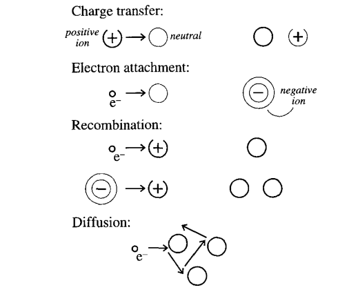

# Ionisation Chambers
Ionisation chambers detect incident radiation through the ionization of gas molecules along the particle track. These ions and their stripped electrons form *ion pairs* which are collected to produce a signal. 

Fast charged particles passing through the detector gas produce (excited) ionised molecules and free electrons along their path through [several types of interaction](../../radiation/radiation-interactions.md). These interactions may occur directly between the incident particle and the gas molecules, or through a secondary process in which a fraction of the incident energy is transferred to a secondary electron ($\delta-$electrons) which subsequently interacts.

The number of ion pairs $N_p$ produced is given by the work function $W$. This value exceeds that of the ionisation energy $E_i$, as there are typically several mechanisms by which incident radiation can lose energy without forming ion pairs. $W$ is a function of particle type, energy, and gas species, though in practice this dependence is not observed be strong; typical values for $W$ lie within the range of $25{-}35\eV$.

<!-- TODO Fano factor -->
The neutral atoms / molecules in the gas are in constant (thermal) motion, with a mean free path of the order $10^{-6}{-}10^{-8}\m$ under standard conditions. Ions and free electrons also move randomly under thermal motion, and diffuse away from regions of high density. This is pronounced for electrons, whose lighter masses yield higher thermal velocities. A point collection of free electrons will spread into a Gaussian distribution whose width increases with time.[^knoll.145] The standard deviation $\sigma$ of this distribution as projected onto some orthogonal axis is given by
$$
\sigma = \sqrt{2Dt}\,,
$$
where $t$ is the elapsed time, and $D$ the diffusion coefficient. There are several types of interaction which may occur when ions, free electrons, and atoms/molecules collide:

<!-- TODO currents *induced* on anode / cathode not by collection itself -->

[^knoll.145]
[^knoll.145]: Glenn F. Knoll, "Radiation detection and measurement / Glenn F. Knoll," , (1989), p. 145.