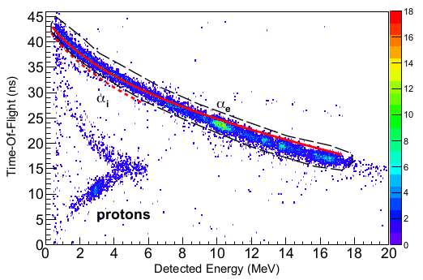

# Thick Target Inverse Kinematics (TTIK)

The TTIK technique is used to perform continuous measurement of an _excitation function_ using a single, fixed beam energy.

The experimental setup involves a thick target volume (usually a gas), where _thick_ implies that the beam is fully stopped within the target. In the above figure, an He gas target is used, with which surrounds the experimental equipment. Typically, a thin window $\sim \operatorname{\mu m}$ is used to separate the gas from the environment, which introduces some uncertainty in the energy of the beam within the target.

The beam energy spans a continuous range, with the maximum defined at the point following the entry window, and the minimum limited only by the scattering process. In order to reach the detectors, the detected particles must have a lower stopping power than the beam nuclei.

The term _inverse kinematics_ refers to a beam with heavier nuclei than those of the target. In this configuration, the scattered light particles are confined to a cone of forward angles in the laboratory frame (for elastic scattering, see [the deflection angle in 2D scattering](../../mechanics/2D-non-relativistic-elastic-collisions.ipynb#Deflection-Angle), which approaches zero as the beam to mass ratio increases), permitting the detectors to be placed solely at forward angles. Additionally, the cross section for Rutherford scattering (of the _target_ nuclei) is at a minimum along the beam (corresponding to $180\degree$ backscattering in the CoM frame).

## Time of Flight Discrimination

To discriminate between elastic and inelastic scatters, one can observe the difference in the time-of-flight (ToF) of the scattered particles, which results from the energy loss during inelastic scattering. The reduced kinetic energy of the system requires that reactions occur closer to the window for the same measured $\alpha$ energy. This leads to a shorter path of beam nuclei within the target, and consequently a shorter ToF, as the target nuclei (with higher mobility) are detected more quickly. Consequently, inelastic scattering events can be isolated from elastic events for a given energy $E$, by separating the two distinct distributions in ToF space.

In the above figure, the elastic scattering events correspond to the locus of points bounded by the dashed black contour line. The inelastic scattering events lie below this region (corresponding to a smaller ToF), denoted by the red dashed line.

Following the identification of the elastic and inelastic scattering events, the centre of mass (CoM) energy $E_\text{com}$ may be determined, using the stopping powers of the beam and target nuclei.

[1]: https://iopscience.iop.org/article/10.1088/1742-6596/569/1/012052/meta

 <!-- TODO write this up: -->

[2]: http://farside.ph.utexas.edu/teaching/336k/Newtonhtml/node51.html
