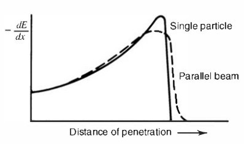
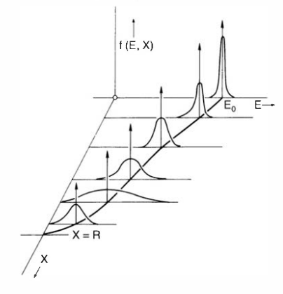
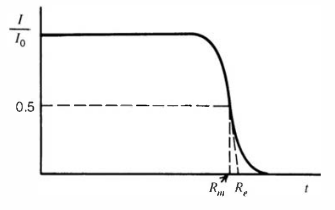

# Heavy Charged Particles

Heavy charged particles such as the $\alpha$ interact primarily through the coulomb force between the particles and orbital electrons within the absorber atoms. Direct interactions between the particles and nuclei _are possible_, though quite unlikely, and are usually insignificant in their effect upon the detector response.

Through the Coulomb force, the passage of a charged particle within an absorbing medium will apply an _impulse_ to the surrounding electrons. Depending upon the proximity of the encounter, the impulse may be sufficient to raise an electron to a higher energy level within the atom (_excitation_), or to remove it from the atom completely (_ionisation_). <!-- TODO: If not excited, how much E is transferred, and how is it dissipated? -->
When treated as an elastic collision, the [maximum energy transfer](../../mechanics/2D-non-relativistic-collisions.md#Energy-Transfer) from a charged particle of mass $m$ with kinetic energy $E$ to a static electron of mass $m_0$ is $\frac{4Em_0}{m}$. This value is so small that the primary particle must lose its energy through numerous repeated interactions during its passage through a material.

For each interaction, the [deflection angle](../../mechanics/2D-non-relativistic-collisions.md#Deflection-Angle) is quite small (as $m \gg m_0$), and interactions occur in all directions simultaneously, hence _the tracks through the material tend to be quite straight_. Hence, charged particles are characterised by a definite _range_ in a given absorber material, which defines the distance beyond which no particles will penetrate.

<!-- TODO: No particles is invalid (?), more like, likelihood very small -->

The product of charged particle interactions will be excited atoms, or _ion pairs_. Each pair is composed of a free electron, and the corresponding positive ion of an absorber atom from which an electron has been removed. These pairs have a natural tendency to recombine to form neutral atoms, but in some detectors this may be suppressed such that the ion pairs are used as the basis of the detector response. In particularly close encounters, an electron may experience a large impulse such that, once unbound from its parent atom, it may have sufficient kinetic energy to create further ions. These _energetic electrons_ are called _delta rays_. Typically, the _majority_ of the energy of the charged particle is transferred via delta rays. _The range of these electrons is always small in comparison to the range of the incident charged particle_, so the ionisation remains close to the primary track.

## Stopping Power

The _linear stopping power_ $S$ for charged particles in a given absorber is defined as the average _specific energy loss_; the differential energy loss with respect to path length within the material

$$
S = -\frac{\mathrm{d}E}{\mathrm{d}x}\,.
$$

The classical expression for $S$ is known as the _Bethe formula_,

$$
\tag{a}
S = \frac{4\pi e^4z^2}{m_0v^2}NB\,,
$$

where

$$
\tag{b}
B = Z\left[\ln\left(\frac{2m_0v^2}{I}\right)-\ln\left(1-\frac{v^2}{c^2}\right)-\frac{v^2}{c^2}\right]\,.
$$

Here, $v$ and $ze$ are the velocity and charge of the primary particle, $N$ and $Z$ the number density and atomic number of the absorber atoms, $m_0$ is the electron rest mass, and $e$ the electronic charge. $I$ represents the experimentally determined average excitation and ionisation potential of the absorber. For nonrelativistic particles ($v\ll c$), it follows that

$$
B\approx Z\ln\left(\frac{2m_0v^2}{I}\right)\,.
$$

**(a)** remains valid for many types of charged particles _provided that $v$ remains large with respect to the velocities of the orbital electrons_ of the absorber atoms.

Given that $B$ varies slowly with $v$ (besides the last term), it can be seen that **(a)** varies roughly as $\frac{1}{v^2}$, i.e. $\frac{1}{E}$. This may be heuristically explained by noting that for large $v$, the particle spends a small amount of time in the vicinity of any electron, and so the impulse (and hence energy transfer) is small. In addition, **(a)** depends upon $z^2$, and so _particles with greater charges have greater specific energy loss_.

## The Bragg Curve

The Bragg curve is a plot of the specific energy loss against the distance of penetration of a charged particle.

As predicted above, the predominant regime resembles a $\frac{1}{E}$ relationship, given that $E$ decreases with distance. The two different curves indicate a different behaviour towards the end of the track, caused by _straggling_.

### Energy Straggling

Energy straggling is caused by the stochastic nature of the interaction process. A plot of the energy distribution of a monoenergetic source against track depth can be seen below.

From an initially sharp peak at $E_0$, the distribution widens with depth because of the compounding effect of interaction uncertainty. Towards the end of the track, the distribution narrows, as the mean energy approaches zero.

### Range Straggling

There are several definitions of the range of a charged particle.

- The _mean range_ is the absorber thickness required to reduce the particle count to one half of its initial value.
- The _extrapolated range_ is the point at which an extrapolation of the linear portion of the transmission curve reaches zero.

The _range straggling_ of a particle describes the variation in path length of particles of the same initial energy.

The origin of these effects is the same as that of the energy straggling. For heavy charged particles, the straggling amounts to a few percent of the mean range, and is observed in the gradient of the step at the end of the path in the figure above.
